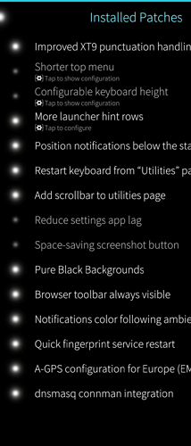

## System Patch Manager p.1

The `Patch Manager` is the tool that allows SFOS users to apply patches, usually to customize the UI and its behavior. The patches are applied with a volatile policy with respect to the reboot. However, this tool has no specific limitation on being able to operate on the root filesystem and un/apply permanent patches. Obviously, this task should be delegated to a shell scripts suite that should also be available for system maintenance and recovery. Moreover, in this way, the UI will be separated from the underlying business logic even more.

You can jump to the end to see how the first implementation approach begins:

* [Technical Approach to the first implementation](#technical-approach)

and then you can read the whole document to learn about the informative process that led to that choice. 

While the next section will summarize you the main ideas about applying permanent system patches.

---

### RATIONALE
 
A system patch manager should be able to record the changes that are affecting the system and un/apply them in a fail-safe way. This means that it must work from a console, and it must work from a recovery image with the minimum additional requisites, possibly none.

Adding a full scripting capability is a little more complex task than including such scripts into a package and running them because shell scripts can do arbitrary things and, in some corner cases (and failures), can do untracked and unexpected things that cannot be reverted with the reverting scripts (eg. `post-install.sh` -> `pre-remove.sh`).

This is true also for RPM packages - mitigated by the fact that package maintainers usually have a system test facility that allows them to automatically validate the RPM packages for a wide variety of scenarios and different system configurations. Additionally, the RPM system is a well-established way of un/installing software that has been in production since 1997.

<sup>________</sup>

**Why do not use RPM to patch the system?**

The documentation of `Patch Manager` claims (in June 2023) that a shell scripting capability to support system patches management is considered too complex for the `Web Catalog`. Moreover, a `Patch Manager` that operates on the root filesystem in order to apply permanent patches is a regression from the point of view of the authors of that software, who suggested using the RPM scriptlets for such a task.

> 
>
> Source: [github comment by Olf0](https://github.com/robang74/redfishos/assets/903069/fddcfa31-ff0e-4a1b-913c-92aeea434bf7) who cites the README.md from the Patch Manager project.

Unfortunately, the RPM is a system to install software, not to apply patches and make traceable system configuration changes. For sure, some tools for this purpose exist out there, and they are named configuration management systems. Usually, they are tailored for a specific system or highly configurable for a class of systems. Unfortunately, SFOS is running on a non standard root filesystem, unlike the most well-established GNU/Linux distributions.

Moreover, the SFOS end-users are used to using `Patch Manager` from the UI. Therefore, it is a quick and immediate way to introduce the system patches, presenting them with the same tools but demanding their un/installation to a proper shell script suite.

Finally, there are many ways to track unexpected filesystem changes, too. In particular, the `inotify` approach can be a long-term general solution that can provide a change log, but it can be tricky to use or, at least, not as immediate as it could seem.

<sup>________</sup>

**Applying patches to the system can brick it**

Backup it, before playing with your root filesystem:

* https://www.tecmint.com/clone-linux-server/

The principle is true for the root filesystem and the users home folders, too.

---

### INTRODUCTION

Reading the description of [this patch](https://coderus.openrepos.net/pm2/project/dnsmasq-connman-integration), we clearly realize that adding shell script capabilities will bring Patch Manager to the next level.

In order to achieve this, there are some specific scripts to keep in consideration:

- pre-install script: `pre-install.sh`
- post-install script: `post-install.sh`
- pre-remove script: `pre-remove.sh`
- post-remove script: `post-remove.sh`

These are the same types that are allowed in any kind of package (rpm, deb, etc.). Obviously, these scripts must be executed with `root` privileges and possibly in a decently set shell environment.

---

### ADDITIONAL INFORMATION

This feature can be implemented in two different ways:

- adding four scripts for each of those tasks with .sh extension;
- adding a single text file with .shell extension with four sections.

In the last case, something like that:

```
[pre-install]
rm -f /etc/resolv.conf
 
#[post-install]
#[pre-remove]
 
[post-remove]
ln -sf /run/connman/resolv.conf /etc/resolv.conf
```

One or another way is indifferent, and It is a matter of taste.

In the .sh case, the files do not need to be executable to run but just be interpretable. However, the .sh approach avoids having a parser splitting the .shell single file, and moreover, it clears up the possible misunderstanding about the chance that every single line will be executed by a different shell instance:

```
/bin/ash pre-install.sh
```

instead of

```
/bin/ash -c "first line"
...
/bin/ash -c "last line"
```

It is suggested to use /bin/ash as the default interpreter, which is powerful enough in terms of scripting even if it does not implement the full set of bashisms.

The scripts running on /bin/ash can run on /bin/bash as well, but not vice versa, and in some systems, /bin/bash could be optional.

An example of the current limitations of `Patch Manager` is that it is great for patching the `UI` but completely inadequate for patching the system.

Due to its way of working, `Patch Manager` is not the right tool for this kind of patch, but the `dnsmasq` `RPM` can be fixed with this patch:

* [dnsmasq-connman-integration](https://coderus.openrepos.net/pm2/project/dnsmasq-connman-integration)

  > Changelog: 0.0.6 - connman starts after patchmanager and dnsmasq before connman (in my wishes).

In practise, this patch will not be applied unless Patch Manager completes its job. Sometimes the `connman` and `dnsmasq` services will start before their .service files have been patched, and therefore the system will not be able to resolve the domain names. Moreover, the network restart from SailFish Utilities cannot solve the issue, and a system reboot might not solve it but usually does.

There is an intermediate layer of complexity between an `RPM` that offers a lot of features (full feature) at the cost of having to deal with its specific syntax (which is quite complex because it should deal with all the dependencies of all the packages in the repository and with the installed ones) and executing shell scripts related to a patch installation.

`Web Catalog` is not the problem because it has to deal with a compressed archive (e.g. `pippo.tar.gz`) while `Patch Manager` has to just execute no more than four simple operations when all four script files exist.

There is a **HUGE** gap between applying a patch (`diff -pruN`) and preparing a `RPM`. In this **HUGE** gap, `Patch Manager` shell scripting capability has its own place.

In fulfilling this gap, it is necessary to keep in mind to step down the learning curve as much as possible in such a way that as many people as possible will be quickly able to provide system patches.

---

### CURRENT IMPLEMENTATION
 
In applying this `Patch Manager` patch:

* [x10ii-iii-agps-config-emea](https://coderus.openrepos.net/pm2/project/x10ii-iii-agps-config-emea)

Two cases arise with the current `Patch Manager` implementation, which are below considered.

**case #1**: `cacerts_gps` folder exists

```
[root@sfos ~]# ls -al /system/etc/security/cacerts_gps
isrgrootx1.pem -> /tmp/patchmanager/.../isrgrootx1.pem
roots.pem -> /tmp/patchmanager/.../roots.pem
```

**case #2**: `cacerts_gps` folder does not exist

```
[root@sfos ~]# ls -al /system/etc/security/cacerts_gps
cacerts_gps -> /tmp/patchmanager/system/etc/security/cacerts_gps
```

Both cases are wrong because `Patch Manager` creates a symlink where it was supposed to create folders and files. In fact, symlinks are not the same story because some tools that operate on the filesystem require a specific option to follow symlinks. Like `tar` and `cp` which are widely used tools for doing backups.

Clearly, in the minds of the Patch Manager developers, this should be considered a feature because it makes the changes volatile and therefore protects the system from any change that can brick it.

This is fine as long as customising the UI is the only aim, but it is not useful for changing the system configuration. Obviously, the risk of bricking the system while changing its configuration should be addressed in a reasonable way.

That reasonable way is **not** do everything to avoid this inconvenience because it would be a lot of work just to limit the useful cases. Instead, provide a shell script suite that is able to un/apply patches even when the system is totally bricked, therefore also at rescue boot time.

---

### REFACTORING EXAMPLE 
 
The approach can be easily changed by following these examples:

```
mkdir /tmp/test
cd /tmp/test
repourl="coderus.openrepos.net/media/documents"
tarball="robang74-x10ii-iii-agps-config-emea-0.2.0.tar.gz"
curl https://$repourl/$tarball | tar xvzf -
```

The following shell code will works with `-p0` and `-p1` because the `sed` `regex` deals with `/var`, `new/var` and `./new/var` indifferently, and every relative `filepath` is converted into an absolute `/filepath`.

```
files=$(sed -ne "s,^+++ *\.*[^/]*\([^ ]*\).*,/\\1,p" unified_diff.patch)
grep -qe "^+++ */" unified_diff.patch || false
plvl=$?
```

Now it is time to do a backup for future restore, but remember that overlay tricks the old `tar`, therefore a recent `tar` or `busybox` `tar` is needed.

```
busybox tar czf /$store_dirpath/patch-$project_name.tar.gz $files
echo "$files" > /$store_dirpath/patch-$project_name.list
```

This determines the uninstall procedure by defining a global non-parametric function.

```
patch_uninstall() { 
  rm -f $(cat /$store_dirpath/patch-$project_name.list)
  busybox tar xzf /$store_dirpath/patch-$project_name.tar.gz -C /
}
```

This is useful before applying the patch in order to create files and folders, not symlinks. Therefore, the symlinks engine can be ignored.

```
patch_apply() {
  ret=0
  for i in $files; do mkdir -p $(basename $i); touch $i; done
  if ! patch -d / $pagrs -p$plvl unified_diff.patch; then 
  patch_uninstall
  ret=$((1+$?))
  fi
  return $ret
}
```

Following the current `Patch Manager` logic and extending it to the system patches applies to the root filesystem as well:

* Is it a system patch?

* For example, `system_diff.patch` instead of `unified_diff.patch`?

* No? Then uninstall at shutdown time.

Why uninstall a system patch at shutdown with the risk of an uncompleted procedure or even not starting at all because a switch-off forced by the user by the hardware keys happened? Because the UI patches are volatile by default, and therefore the system patches should be? It does not make sense.

Anyway, we keep going on this track to see what will follow:

```
num=$(printf "%05d" $(ls -1 /$store_dirpath/[0-9]*.tgz | wc -l))
busybox tar czf /$store_dirpath/$num-$project_name_applied.tar.gz $files
```

At boot time, after the udev filesystem has been settled down and before every `systemd` service will start, the restoring procedure will apply all the chosen patches in their correct sequence.

```
files=$(ls -1 /$store_dirpath/[0-9]*_applied.tar.gz)
test "$files" = "" && exit 0
for i in $files; do busybox tar xzf $i -C /; done
```

After this, the boot sequence can be continued as usual.

---

### FURTHER INVESTIGATION

Here is the information collected and the notes taken in the first month of the SFOS internal investigation.

---

#### PART #1

This seems promising for installing system updates for those that do not require a reboot:

* https://man7.org/linux/man-pages/man7/systemd.special.7.html

  ```
  system-update.target, system-update-pre.target,
  system-update-cleanup.service
      A special target unit that is used for offline system
      updates.  systemd-system-update-generator(8) will redirect
      the boot process to this target if /system-update or
      /etc/system-update exists. For more information see
      systemd.offline-updates(7).
  ```

* https://man7.org/linux/man-pages/man7/systemd.offline-updates.7.html

It seems like a general solution that requires - by documentation - a reboot, but the reboot is managed by the configuration and not automatically enforced.

However, due to its specific nature and delicacy, it can be better to add a service related to `system-update.target` rather than - for example - `system-update-pre.target` in such a way that the patches that might conflict with package updates will be applied as expected to be or fail instead of being silently overwritten by the updates.

---

#### PART #2

The `Patch Manager` patches can be applied and unapplied many times during a user session, and this is a great feature.

However, extending the way in which `Patch Manager` works, the system patches might not fall into this category.

For example, [DNS Alternative](https://openrepos.net/content/kan/dns-alternative) is delivered like an `RPM` and probably an `RPM` is the best way to have it.

The way of providing a change could be exemplified in three main passages:

   1. system patch -> 2. optional RPM package -> 3. default RPM package 

Which also implies three different levels of integration with `SFOS`: unsupported (community only), supported in terms of repository consistency (community aided by professional technical support) and fully supported (commercial support). Therefore, there are three different levels of `SLA` and `QoS` in terms of supporting end-users.

In my opinion, the main difference between a system patch and an `RPM` package is bringing into the system new binaries rather than modifying the system configuration.

In this second case, having a system patch seems more reasonable, especially for the end-users who can choose to reconfigure the system as they wish - in the same manner they are doing with `UI`.

While `UI` patches can require an application restart and - for example - the fingerprint reader patch is functionally identical to a patch for the Settings page. 

Those patches that have an impact to the network and rely on the installation of 3rd party packages, e.g. `dnsmasq` needs a little more attention. In fact, restarting the network by `SailFish Utilities` does not bring the expected result because - for some reason - it does not contemplate the case in which `dnsmasq` is installed and configured.

This might suggest us that the `Patch Manager` was designed for changing the UI and its behaviour only. However, a deeper analysis points towards a more general problem: a lack of coordination among various components among those that are usually installed for SFOS.

Back on the main track, the conclusion is that there are three patch classes:

1. those changes `UI`, app, stand-alone service level: easy to restart;

2. those changes some complex services like network/d-bus: the related services might not be restarted unless a proper support;

3. those changes the system at such a level that a reboot is needed: because, at the moment, `telini 1; telinit 5` fails in a way that an emergency shutdown is required.

The #1 and the #3 are almost straightforward cases to deal with. The second is a matter of setting a policy that allows restarting system services in the most general case.

---

#### PART #3

Here is the step-by-step procedure to activate the patches application at boot time:

* Settings:System -> Patchmanger:Settings -> Activate enabled Patches when booting.

**Why** activate them at boot time instead of making them permanent with that option?

This question is extremely relevant - not only for the consequences that it brings in terms of constraints - but also because it is a design choice.

This design choice should be explained in detail in the documentation, but it was not. It is a relevant missing because everyone who has further develop the `Patch Manager` needs to figure out for him/herself why that choice has been made and if the premises of that choice are still valid.

Only, after these questions have been answered, s/he can take a decision about how to extend the `Patch Manager` functionalities.

The answer reported by people involved in the project is that in the past, Patch Manager was applying patches in a permanent way to the root filesystem, but this had to be changed because sometimes the patch application drives the system out of order, preventing the UI from working, and then to disable the root cause.

This confirmed beyond any doubt that a shell scripts suite for un/apply patch able to work at any system stage is a must-to-have.

We can evaluate a change between "*activate at boot time*" and "*keep persistent*" by doing a confrontation:

* persistence is easier because we "*patch & forget*"
* forgetting is not a good practise; therefore, check
* checking, but when?
* every time the 'Patch Manager` page is shown
* how can we implement this check?
* `pach -Rp0 --dry-run` can fail or not
* is it quick enough?
* yes -> done

Here we are. We can have a `Patch Manager` for persistent patches with a few changes.

<sub>________</sub>

**About the better solution**
 
1. It has been shown that it is easy and feasible to patch the filesystem (files and directory) without creating links to a temporary directory.
2. The `Patch Manager` can move easily from "*apply at boot time*" to "*persistent mode*" with the check by `--dry-run` option, which is probably already implemented because currently the `Patch Manager` is able to detect when a patched file is changed.
3. Avoid that `Patch Manager` removes patches when the system is asked to go down for shutdown or reboot.
 
In particular, about point #3, It has been tested with success and satisfaction a `killall -9 patchmanager`. Obviously, this alone cannot provide persistence because `/tmp/patchmanager` is volatile.

Now, it is the proper time to make a test based on the information collected with `find /tmp/patchmanager -type f`. Something like this:
 
0. collect the list of files using `find`
1. backup all the system files when all patches are disabled (original versions), which probably is not necessary because it is reasonable that they are stored somewhere
2. kill the `patchmanger` process
3. use the list of files to remove the links and replace them with real files
4. start again the `patchmanager` to check how it is going to behave
5. do a system reboot instead of point #4
 
This test is leveraging the blackbox approach. It is the only approach possible when the source code is unavailable but it still useful also when the source code is available for inspection because it is much easier to understand others people source code when we know what is supposed to do that source code.

About point #2, in checking the `/tmp/patchmanager3/patchmanager.log`, we can find that the check with `patch -R` + `--dry-run` is exactly what `Patch Manager` does to check that each enabled patch is applied correctly.

---

#### PART #4

This patch might not work because of the `Patch Manager` constraints that it might have. However, the only way to know is to take a test with it.

<sub>

```
--- /usr/libexec/pm_unapply
+++ /usr/libexec/pm_unapply
@@ -25,7 +25,8 @@
 PATCH_EDITED_NAME="unified_diff_${SYS_BITNESS}bit.patch"
 PATCH_EDITED_BACKUP="$PM_PATCH_BACKUP_DIR"/"$PATCH_EDITED_NAME"
 
-ROOT_DIR="/tmp/patchmanager"
+ROOT_DIR="/"
+TMP_ROOT_DIR="/tmp/patchmanager"
 
 # Applications
 PATCH_EXEC="/usr/bin/patch"
@@ -66,6 +67,7 @@
   exit 0
 }
 
+files=""
 verify_text_patch() {
   if [ -f "$PATCH_FILE" ]; then
     log
@@ -74,6 +76,12 @@
     log "----------------------------------"
     log
 
+    files=$(/bin/sed -ne "s,^+++ *\.*[^/]*\([^ ]*\).*,/\\1,p" "$PATCH_PATH")
+    for i in $files; do
+      [ -L "$i" ] && /bin/rm "$i"
+      [ -f "$TMP_ROOT_DIR/$i" ] && /bin/cp -arf "$TMP_ROOT_DIR/$i" "$i"
+    done
+
     $PATCH_EXEC -R -p 1 -d "$ROOT_DIR" --dry-run < "$PATCH_FILE" 2>&1 | tee -a "$PM_LOG_FILE"
   fi
 }
@@ -87,6 +95,7 @@
     log
 
     $PATCH_EXEC -R -p 1 -d "$ROOT_DIR" --no-backup-if-mismatch < "$PATCH_FILE" 2>&1 | tee -a "$PM_LOG_FILE"
+    for i in $files; do [ -s "$i" ] || /bin/rm -f "$i"; done
   fi
 }
 
--- /usr/libexec/pm_apply
+++ /usr/libexec/pm_apply
@@ -29,7 +29,7 @@
     source /etc/patchmanager/manglelist.conf
 fi
 
-ROOT_DIR="/tmp/patchmanager"
+ROOT_DIR="/"
 
 # Applications
 PATCH_EXEC="/usr/bin/patch"
@@ -69,6 +69,13 @@
     log "Test if already applied patch"
     log "----------------------------------"
     log
+
+    files=$(/bin/sed -ne "s,^+++ *\.*[^/]*\([^ ]*\).*,/\\1,p" "$PATCH_PATH")
+    for i in $files; do
+      if [ -L "$i" ]; then
+        /bin/rm "$i" && /bin/touch "$i"
+      fi
+    done
 
     $PATCH_EXEC -R -p 1 -d "$ROOT_DIR" --dry-run < "$PATCH_PATH" 2>&1 | tee -a "$PM_LOG_FILE"
```

</sub>

It works, proving that the `Patch Manager` can be easily converted to apply system patches as well.

---

#### PART #5

A modified fork for testing of the original `Patch Manager` is available here:

* [patchmanager fork](https://github.com/robang74/patchmanager)

The `pm_apply` and `pm_unapply` shell scripts have been unified into a single `pm_patch.env` because most of the code was redundant. Therefore:

* `pm_apply` does `source pm_patch.env apply "$@"`
* `pm_unapply` does `source pm_patch.env unapply "$@"`

This helps to maintain such shell script code in the future.

<sup>________</sup>

**A few examples**

Using the `patch` without `-r /dev/null` every `.rej` file breaks the restart of a daemon when such a file is located in a folder like `cond.d`  and then mess up everything.

In fact, after a patch application failure, the `.rej` file prevented a system daemon from loading. Obviously, it is also a daemon bug because it should ignore `.origin`, `.rej`, `.rpmold` and `.rpmnew` files by default.

* https://github.com/sailfishos-patches/patchmanager/commit/21f3e6698049f508e55f6ffc508031c57f522f2e

A simple rule for patch file path parsing was implemented in C++ code with a couple of nested loops. Here is the link to the commit:

* https://github.com/sailfishos-patches/patchmanager/commit/f247da61c2e2df06274b00d40ddc605b98740ade

A succulent corner case is show below:

* https://coderus.openrepos.net/pm2/project/utilities-quick-fp-restart

This patch above, in v0.0.1 and v0.0.2, can be applied multiple times. While v0.0.3 cannot.

This denotes that `Web Catalog` is not providing any checks about patches. It is impossible that it could because it has no knowledge about the SFOS filesystem. Therefore a tool for testing and validating the patches can be implemented into the shell script suite, which takes care of their un/installation. After all, it just a matter of giving to that suite the correct UI to accomplish also this task.

---

### PROPOSAL EVALUATION

> @miau wrote:
>
> If I remember correctly patchmanager in the old days did modify the original files directly. Back then a patch could break your device, for example lipstick doesn’t start anymore after a reboot.

This can be a real issue. Thanks for having highlighted it.

It can be solved in another way without renouncing to have a `system configuration manager`. This is the reason because, since the first comment in this thread, I have included some code and suggested making a system backup of each patch.

How do we revert the backup in case of a system failure? It can be done with a user-land watchdog  and `dsmetool` seems like a useful piece of software to deal with a controlled reboot after the watchdog expired.

> @miau wrote
>
> Or not unapllying all patches before a system upgrade could break the system.

Also, this can be a real issue. Thanks for highlighting it.

This means that the upgrade procedure should be better implemented. After all, there is the command to uninstall all the patches immediately available: `patchmanager --unapply-all` which deactivates and disables (unapply) all patches.

Despite having reverted all the patches, the SFOS upgrade can fail because the user made some changes, including installing RPM packages.

Therefore, before the upgrade, a procedure should be run for doing a backup of the system, and the recovery procedure above will also solve the system upgrade failure by reverting the system to its previous state.

> @miau wrote:
>
> Please stop whining around, because of your dnsmasq patch. Only a few people who use SFOS are using PM and alot less are using dnsmasq. Make a RPM,make a script, make a patchmanager fork or something else, but please stop spamming the forum with totally off topic posts about your view of the world.

Sorry, here you missed the whole point, but I can understand you because I wrote a lot about PM NextGen. Therefore, a little recap is necessary:

* The `dnsmasq` `connman` integration is a test because the [DNS Alternative](https://openrepos.net/content/kan/dns-alternative) is considered the way to go and it contains `dnsmasq`.

* The correct approach is to fix the `dnsmasq` and `connman` RPMs and this is clearly stated in the [patch description](https://coderus.openrepos.net/pm2/project/dnsmasq-connman-integration), therefore this information should also be considered acquired and accepted.

* The [Quick Start Guide](../quick-start-guide.md) diverged from its original aim and started to collect parts that, IMHO needed to be fixed. Progressively, it moved from being a "*end-user*" guide to a "*product-manager*" guide. Thus, it still reports my patch because it is a corner case.

* There is a huge gap between patch applications (even with a little scripting support) and RPMs packaging because the RPMs repository - the sum of all repositories of all contributors - should NOT make a SFOS upgrade procedure fail. As you can read in the forum, the upgrade failure seems normal instead. Or at least not a so-rare incident.

By the way, the main question is:

* **why we should care** about modding the SFOS in such a manner that can support a *system configuration manager* and a *fleet management tool*?

The first and straightforward answer is:

* a safe and friendly relationship with upgrades

but there is **much more** related to these two tools. That **much more** is the profitability or, from a non-commercial point of view, the maintainability of the operative system with as less as possible effort. In a word: efficiency.

After all, unless people here wish to follow a strict policy about RPMs repository like Debian, Ubuntu, RedHat, SuSE, etc are doing which brings a lot of top-down organised work (debian is a non-profit foundation, in fact), then those two tools are the solely way to go in order to obtain something equivalent or at least, a restore system to the last working configuration.

One more consideration: `ZFS` allows filesystem snapshots that can be rolled-back, but it is not the right approach for dealing with a fleet of IoT devices. It is tailored for servers and can be tricky to use on mobile devices, where `BRTFS` has the ability to check for corrupted blocks and `EXT4`, with its journaling, can quickly self-repair itself at boot time.

Finally: 

* am I going to change the `Patch Manager` in order to make it a *system configuration manager*?

I do not think so. Since the beginning, I have been thinking about another completely different solution, much more flexible. But it would be a shame to not learn from what has been done.

---

#### TECHNICAL APPROACH
 
Developing a shell scripts suite that can be integrated with a slightly modified version of the current `Patch Manager` is the main way.

Instead of starting with a generic and arbitrary shell scripting capability, I focused on system configurations and their system services.

While distributing the system patches using the `Web Catalog` is also a good and natural way to go with.

For this purpose, adding a header to the patch is enough to cope with the most common cases.
 
This is a testing patch that is going to go that way:
 
* https://coderus.openrepos.net/pm2/project/dnsmasq-connman-integration
 
Here is an example of such a header for testing purposes:

<sub>

```
#!/bin/bash ## this line for a patch which header is a shell script ############
##
## (C) 2023, Roberto A. Foglietta <roberto.foglietta@gmail.com>
##           released under MIT (tlo.mit.edu) license terms
##
## This is a system patch header example for SailFish OS system patch manager
##
#\header #######################################################################
#
# type: system
# target: sfos
# services: dnsmasq connman
#
## optional fields using tabs instead of spaces just for test ##################
#
# name: dnsmasq-connman-integration # a comment
# provider: robang74 # another comment
# version: 0.1.1 # yes another one
#
## a repetition, a variant and an unrecognised fields just for test ############
#
# name      : dnsmasq-connman-integration-not-fit # this should raise a warning
# services : dnsmasq, connman;
# string : "hello world"
#
#/header #######################################################################
#
## put the shell script body between this line and the --- end of header mark ##
---
```

</sub>

Just a set of essential information, in which the vital field is:

* `services: dnsmasq connman`

which lists the system services that should be reloaded and restarted as a consequence of un/apply the configuration patch. 

It is vital information because everything else is to separate the volatile UI from the permanent system patches and to separate the application of those patches between the SFOS and your laptop/PC GNU/Linux system.

After all, the beauty of such an approach is that it can be used for every GNU/Linux system and every other system that is reasonably similar and provides a shell compatible scripting environment.

---

### UI IMPROVEMENT

As we can see in this screenshot:



the Patch Manager (de)activation dots are dangerously near the swipe left border.

Therefore, adding the "tap to undo" grace period will be useful and safer.

Especially when the list of patches is very long and is fulfil the whole screen lenght.

---

### WEB CATALOG LABELS

It would be useful to have two labels: **`ALPHA`** in red and **`BETA`** in yellow to clearly inform the users that a patch is not ready for universal deployment. Considering how `Patch Manager` works, the `Web Catalog` needs to consider such labelled patches under testing and show them clearly to the users. After all, just one label is strictly necessary: `TESTING`.

When the label is present, the `Web Catalog` will allow the developer to change the uploaded tarball as many times as s/he needs to for as long as s/he needs to. If the last package can always be changed, there is no need to modify the `Web Catalog`. However, incrementing the version number when a new tarball (different md5sum) is uploaded can be a very useful automatism.

There is an option in `Patch Manager` that sets the developer mode. The labelled patches will show up only when that mode is enabled.

A quick way¹ to add the `TESTING` feature is to add on the top of the list a special version like `0.0.0.0` into the version management. That version could be enforced only in `Patch Manager` *developer mode* with *strict version check* disabled. Which is not something that the end-user will do by accident. However, a full implementation is suggested because versioning can also be useful for a 1.0.5-testing which usually would be 1.0.5-rc3 where `-rc3` means release candidate three, as usual.

**Notes**

¹ the inspiration came from @carmenfdezb who wrote: *I think that you have to enable developer mode from settings in Patchmanager, and select ‘No’ in the ‘Check version’ option*.
