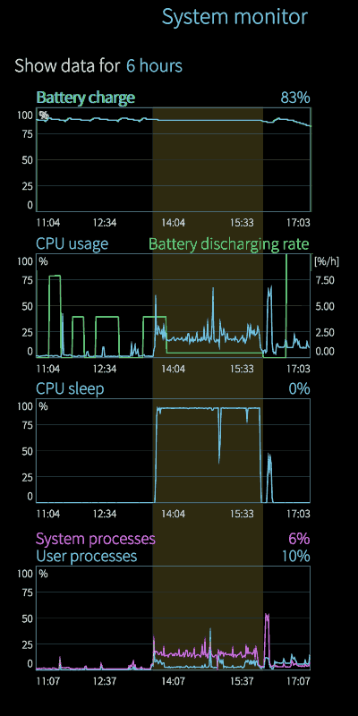
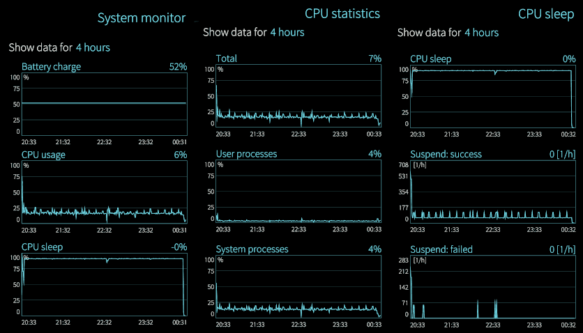
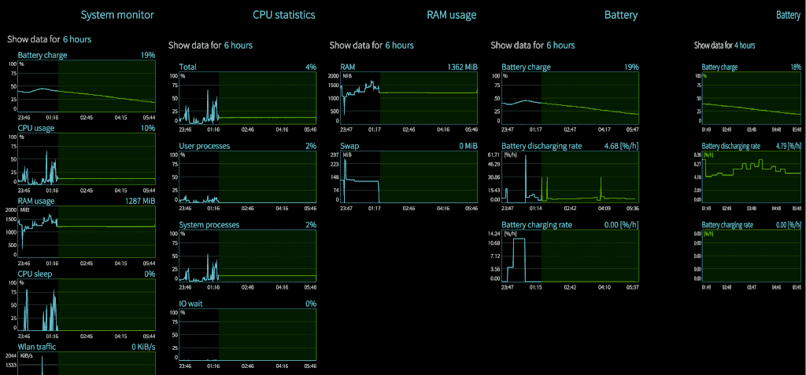
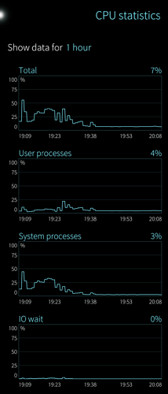

## Energy saving for Xperia 10 II and III

* `OS VERSION` : 4.5.0.19
* `HARDWARE` : Xperia 10 II dual SIM
* `ANDROID SUPPORT` : licenced and installed
* `UI LANGUAGE` : English

---

### APPROACH

Recently I set the energy saving mode at 100% of battery threshold which means always active:

* [using mcetool to change the power saving threshold](../knowhow/battery-recharge-and-power-saving.md)

Moreover, I dimmed the brightness of the screen to the minimum and I have installed and activated the [Pure Black Backgrounds ](https://coderus.openrepos.net/pm2/project/patch-i-see-a-red-door) patch which it expected to save energy with OLED display which is the case. The display is set to sleep after 30 seconds.

---

### DATA COLLECTED

The [System Monitor](https://openrepos.net/content/basil/system-monitor) was running since the beginning and collecting data. Here a composition of what I found:



The high-resolution image is available for download from [here](https://drive.google.com/file/d/1EJvPc5XkaWFy07DPnLuiD9vSIBqkj7X6/view).

---

### SCENARIO

In the area highlighted, the smartphone was resting alone with no native nor Android application apparently running and with the `Android Support` active.

Despite this the activity about system processes were more intense that normal usage but despite this the battery discharge rate was less or about 1% which is a great achievement.

---

### OBSERVATIONS

Counter side effects: some sub-system were not working when the smartphone has been waked-up. In this specific case the Bluetooth. More often the fingerprints reader gets asleep probably and should be reset.

* [Fingerprint reader restart in LockScreen](fingerprint-reader-restart-in-lockscreen.md)

There is a huge opportunity to extend the battery life leveraging the power save mode as far as all the hardware subsystem are awaken correctly and at expense of the response time because applications starting lag a bit.

This [Reduce settings app lag](https://coderus.openrepos.net/pm2/project/sfos-patch-settings-fix-startup-lag) patch changes the way in which the visualisation of some SFOS native menu/app are presented but not the time of starting of an Android apps.

---

### PROPOSAL

The `START` / `STOP` states for the `Android Support` are not enough because clicking on an Android app, also the `Android Support` starts automatically. It would be much better having an option to disable the `Android Support` to avoid that it can support any application without the express will of the user:

* `disabled, stopped` - A.S. is not running and it will not start automatically
* `disabled, running` - A.S. is put in a sleep state for which it results unavailable
* `enabled, stopped` - A.S. behave like now starting when requested by an app
* `enabled, running` - A.S. behave like now when it running giving the service

With these options the Android Support can be kept safely disabled but quickly gives it service if the user needs it. This will make the SailFish OS more reliable about Android apps background activities and more energy saving.

---

### FURTHER INVESTIGATION

My Xperia 10 II is running with energy power saving always active and at the beginning it shown some troubles about bluetooth and fingerprint reader awakening which forced me to reset that sub-systems.

After having configured some options about suspending/awakening hardware subsystems in Android while I was running the Android Support, the bluetooth and fingerprint reader reader never got stuck anymore even with AS stopped. However, the counter side is that my smartphone - when left alone without no any interaction or connections active - started to be busy in suspend/awake the systems continuously loading the CPU for 25% but with no impact on the battery discharge rate (less than 1%) because the CPU seems busy by System Monitor handling I/O but no power is drained because there is no code/math processing.

In fact, the `dmesg -Hw` shows a lot of this stuff on the WARN level and above:

<sub>

```
[  +0.000236] ------------[ cut here ]------------
[  +0.000202] WARNING: CPU: 7 PID: 6013 at /home/abuild/rpmbuild/BUILD/kernel/sony/msm-4.14/kernel/mm/vmscan.c:1685 isolate_lru_page+0x1e0/0x1e8
[  +0.000365] ---[ end trace b94aa1c373c520dc ]---

[  +0.001869]  cache: parent cpu2 should not be sleeping

[  +0.026021] OOM killer enabled.
[  +0.000003] Restarting tasks ... done.
[  +0.022791] PM: PM: suspend exit 2023-06-18 08:17:15.039700682 UTC
[  +0.000003] PM: suspend exit
[  +0.045724] ## mmc1: mmc_gpio_set_uim2_en: gpio=101 value=1
[  +4.943132] PM: PM: suspend entry 2023-06-18 08:17:20.028365718 UTC
[  +0.000016] PM: suspend entry (deep)
[  +0.000010] PM: Syncing filesystems ... done.
[  +0.015110] Freezing user space processes ... (elapsed 0.040 seconds) done.
[  +0.040466] OOM killer disabled.
[  +0.000002] Freezing remaining freezable tasks ... (elapsed 0.003 seconds) done.
[  +0.003784] Suspending console(s) (use no_console_suspend to debug)
[  +0.029206] Disabling non-boot CPUs ...
[  +0.002401] CPU1: shutdown
[  +0.005101] CPU2: shutdown
[  +0.004633] IRQ 7: no longer affine to CPU3
[  +0.000259] CPU3: shutdown
[  +0.004800] CPU4: shutdown
[  +0.003805] CPU5: shutdown
[  +0.003962] CPU6: shutdown
[  +0.004003] CPU7: shutdown
[  +0.003154] suspend ns:   30885642235516 suspend cycles:    1068241562170
[  -0.000010] resume cycles:    1069294245240
[  +0.000854] Enabling non-boot CPUs ...
[  +0.001628] CPU1 is up

[  +2.401109] somc_panel_color_manager: somc_panel_inject_crtc_overrides (788): Override: Already have original funcs! Is setup called twice??
[  +0.000435] somc_panel_color_manager: somc_panel_pcc_setup (886): Cannot read uv data: missing command
```

</sub>

If what written above is correct (because correlation does **not** necessarily means cause-effect relationship) then `SFOS` should correctly set the FP reader about suspend/awakening. About bluetooth, one single event even in conjunction with the FP reader failure make the assumption statistically too weak,



Original hi-res image is [here](https://drive.google.com/file/d/1nHU4bdjLfSURLdnk8n2IRDYjOMrKY5xp/view).

---

### POWER SAVING TEMPLATES

It makes sense to develop and adopt few templates which are system configurations about power management.

Below, the description of these templates in terms of their features.

<sup>________</sup>

**A. nightly stand-by**

1. `WiFi`, Bluetooth, mobile data, fingerprints reader, sensors, photo cameras and `GPS` all off and as far as possible their hardware subsystems should be powered off. For the `GPS`, the [gpstoggle](https://openrepos.net/content/halftux/gpstoggle) can do that but for the other hardware subsystems I have not checked, yet.

2. The `Android Support` should be disabled and `zRAM` swap should be off-loaded with [the script from this patch](https://coderus.openrepos.net/pm2/project/zram-swap-resize-script).

3. CPUs [0-3] for Xperia 10 II and CPUs [0-1] for Xperia 10 III should be set to minimum working frequency and to `conservative` scaling mode. The other CPUs, the same but put off-line (all the processes will switch to other online CPUs). Linux kernel, real-time and some few specific system processes that need to deal with time jittering tend to rely on CPU #0 only. Moreover because the [0-3] belong to the same multiple-cores CPU, all of them can be kept online. **Update**: considering that on Xperia 10 II, the CPUs [0-4] are 1.8GHz while the others are at 2.0GHz the first CPUs set is also the one more conservative in terms of power consumption. Instead, in Xperia 10 III the most powerful CPUs probably will be at [7-8] enumeration. Therefore for the Xperia 10 III, putting just those 2 cores off-line will result in a smaller power save. 

4. the external `MMC` card should be unmounted and its hardware controller powered off while the internal `SSD` flash should be put in the power saving mode.

5. the display should be kept powered off unless hardware keys are triggered.

<sup>________</sup>

**B. daily stand-by**

This templates is similar to *night stand-by* but with these differences:

* the second set of the CPUs are kept online without enforcing their working frequency but the max working frequency can be limited to the half of the hardware max working frequency aka top scaling cap.

* the `Android Support` - if it is running - keeps running thus the `zRAM` swap off-loading will be not performed when this template is applied, unless the `Android Support` was not running.

* only the hardware related to unused/inactive services (WiFi, Bluetooth, GPS, mobile connection, etc.) should be powered off.

* sensors should be kept powered on because they can be useful for some apps like shaking the phone to switch on/off the flashlight but not the compass unless `GPS` is active or used by an application. Like the fingerprints reader, the compass should be awakened when requested by an application.

* external MMC can be mounted and kept ready. Most depends how fast / reliably we can `mount` and `umount` such a partition when it is not used by any application or by the implication about having a fake-root filesystem-overlay (probably none but it has to be verified and tested).

<sup>________</sup>

**C. daily power saving mode**

This templates is similar to *daily stand-by* but with these differences:

* the first set of `CPU`s are put in `interactive` (mark2) or `ondemand` (mark3) frequency scheduling policy while the others are in `conservative` mode. A top cap about the max working frequency can be set for the second group of `CPU`s. Therefore the user can decide between *daily power saving* mode or *daily power saving plus* mode by an option (one or another).

* without the *plus* option activated, also the internal flash are set to a more responsive / performing power saving mode.

<sup>________</sup>

**D. daily performance mode**

When a battery is less important than productivity or the smartphone is connected to a power source then all the policies can be set to the most performing option available.

<sup>________</sup>

**E. general settings**

These following settings apply to all the power management templates.

* The fingerprint reader and the photo cameras should be kept switched off unless the few cases in which should be temporarily awakened for its duty.

* The `GPS` should be powered off when it is not used. The same for Bluetooth and `WiFi` subsystems.

* The `WiFi` tethering should be not ask which is the source  of data networking (`SIM1`, `SIM2`, `WiFi`) because the user may want to use it to access to the smartphone locally and we do not know which network services s/he installed to be used. Moreover, when WiFi tethering is asking for which source should be used to share the data connection, it mess-ups the state of the toggle button in the topmenu about mobile data when a SIM is chosen. Under this PoV the related Settings page should be renamed from "internet sharing" to "wifi tethering" 

* The WiFi tethering should be powered off when it is not used by any client for a user-customizable timeout (eg. 5, 10, 15, 30, 60 minutes) but the user can disable this by default.

* Few default native applications takes too much time to be started {phone, `SMS`/text, contacts/people, photo camera} but these applications are supposed to be used also in emergency situation like calling the 112/911 or call/texting the home/family or take a shot/video of an incident and any other situations in which a photo/video proof can have a sensible impact about legal consequences. For this reason, these apps should be put in run, kept in run, restarted quickly when they are not running (1-min or immediately waiting on their `/proc/$pid/cmdline`¹) as many times is necessary and the user should be notified when N restarts fail consecutively in such a way s/he can act accordingly.

* The default camera app should be replaced in the above role by the [Advanced Camera](https://openrepos.net/content/piggz/advanced-camera) when the end-user decides so (optional). Therefore a Settings page about always-running apps should be created.

* Some other native default apps that the user optionally can decide to keep ready are clock/alarms, calendar, todo-list, notes. These apps lag-to-start can have a social impact: you are in a hurry and meet a person, then you need to set some quickly some schedule, alarm or simply take a note/todo reminder. Some todo reminders should have an alarm associated but I did not see this feature implemented.

* The always running native apps should not be closed in the default way (with `kill $pid`, probably) but set to a suspended state (with `kill -STOP $pid`) and then awaken when they are started again (with `kill -CONT $pid`). This is an efficient way to have them ready to run.

<sup>________</sup>

**Notes**

¹ In all the Linux systems that I had the chance to work on, the `/proc/$pid/cmdline` still exists when a process is terminated but it is a zombi. In such a case that `procfs` item is void with zero size. Therefore, the suggestion to wait on `/proc/$pid/cmdline` is not completely correct but choosing another instance in the same folder is subjective/arbitrary.

---

### ABOUT THE FUTURE OF SFOS

Before answering this question, we should agree what is `SFOS` and what is not. However, I wish to skip this premise and go straight to the point with this image:



The original high resolution image is [here](https://tinyurl.com/28kv3zga).

What’s this image show? A sleeping system when untouched that consumes 5%/h of battery which means 20h of stand-by. It is not a great achievement because it should be 100h of stand by for an optimised system ([here ](https://forum.sailfishos.org/t/standby-battery-high-drain-on-xperia-10-iii/15208/6)).

On the other hand, we notice that `CPU` stops to be polluted and falls asleep and awakens constantly (sleep, awake, sleep, awake) apparently without a real need. BTW, the system consumed 5%/h of battery - while untouched with the `CPU` s which **NEVER** goes to sleep. This means that apart from the display consumption, `4G` and `WiFi` connections, the system was running at its 100% of the time.

Now, with the `4G` data mobile and `WiFi` tethering connections active, it sucks 6%/h. Therefore the changes tested are more suitable for a daily calm working session rather than keeping the smartphone near our bed while we are sleeping (check [here](#power-saving-templates)).

<sup>________</sup>

**How did I achieved this?**

This is the log of that day and changes:

1. in the morning I developed [this patch to fix few udev rules](https://coderus.openrepos.net/pm2/project/x10ii-iii-udev-rules-fixing) and applied to the system - reloading and restarting the systemd-udevd and related services would have been enough but I did a reboot for be 100% sure to not have bad surprises after.

2. During the day, I used it with different applications and for several tasks also with `Android Support` and Android apps.

3. Before leaving the smartphone untouched for 4h, I did a swap offload using [the script conveyed by this patch ](https://coderus.openrepos.net/pm2/project/zram-swap-resize-script) about `zRAM` and applied some power management rules (not published yet) about CPUs and internal `SSD` flash devices.

<sup>________</sup>

**Why this achievement matters?**

From a point of view of the performances, it is not a game changer. From the `PoV` of bringing the `OS` part of `SailFish OS` under strict control - in particular about power management vs performances - it is a huge advancement.

After all, the great business that Google and Apple did was not about their `OS` but about their Market revenues. In fact, there is no hope for app developers to earn good money as long as the operating system below their app is out of control and does not provide consistently good performances.

Which is the reason because the Linux kernel won the global challenge of being adopted. Also in this case, the great business is not about the kernel itself but about all the applications that can run because that kernel delivers a consistent good `QoS` (quality of service).

Think about this, because it is about the future of `SFOS` much more than everything else.

---

### CPU GOVERNORS

> @direct85 wrote:
>
> Another yolo test: setting the governor to `ondemand` yields the lowest frequencies when idling, but boosting rapidly when needed:
>
> ```
> echo -n "ondemand" > /sys/devices/system/cpu/cpuX/cpufreq/scaling_governor
> ```
>
> where `cpuX` is `cpu0` , `cpu1` … `cpu7` .
>
> The default values were `schedutil` for cpu0…5 and `performance` for cpu6…7.

Here there is about 100 options about power governators:

* [Saber's guide on CPU governors, I/O schedulers and more!](https://forum.xda-developers.com/t/ref-guide-sabers-guide-on-cpu-governors-i-o-schedulers-and-more.3048957/)

But those available are here listed:

```
# cat  /sys/devices/system/cpu/cpufreq/policy[0-7]/scaling_available_governors
conservative powersave interactive performance schedutil
```

It would be possible to keep 4 cpu in a conservative mode and 4 in schedutil or any combination. I am not aware if it is better to run at full throttle few CPUs or keep balanced. My gut feeling indicates the second but ....

I am trying this one configuration:

```
for i in /sys/devices/system/cpu/cpu[0-3]/cpufreq/scaling_governor;
do echo "interactive" >$i; done

for i in /sys/devices/system/cpu/cpu[4-7]/cpufreq/scaling_governor;
do echo "conservative" >$i; done

mcetool \
	--set-power-saving-mode=enabled \
	--set-low-power-mode=enabled \
	--set-psm-threshold=100 \
	--set-forced-psm=disabled \
	--set-ps-on-demand=enabled
```

Different hardware have different configuration but most the commands are the same.

* Xperia 10 III : Octa-core (2x2.0 GHz Kryo 560 Gold & 6x1.7 GHz Kryo 560 Silver)

* Xperia 10 II : Octa-core (4x2.0 GHz Kryo 260 Gold & 4x1.8 GHz Kryo 260 Silver)

Therefore it makes sense to have two different governor policies in the two CPUs sets:

```
for i in /sys/devices/system/cpu/cpu[0-1]/cpufreq/scaling_governor;
do echo “ondemand” >$i; done

for i in /sys/devices/system/cpu/cpu[2-7]/cpufreq/scaling_governor;
do echo “conservative” >$i; done
```

The differences for Xperia 10 III in the shell script are very little.

<sup>________</sup>

**Sleeping CPUs**

Considering also the application of the [udev patch](https://coderus.openrepos.net/pm2/project/x10ii-iii-udev-rules-fixing) at system level, when the SFOS is correctly configured the CPUs finally sleeping like dead rats while the UI is still responsive:



Despite the results achieved, these messages in the system log are NOT completely gone just mitigated. It seems that the [problem is known](https://forum.sailfishos.org/t/xperia-10-ii-bugs/6321/37) since the SFOS v4.4.0.68, at least.

```
[  +0.000108] OOM killer enabled.
[  +0.000001] Restarting tasks ... done.
[  +0.013891] PM: PM: suspend exit 2023-07-03 18:52:53.726781389 UTC
[  +0.000002] PM: suspend exit
[  +0.048486] ## mmc1: mmc_gpio_set_uim2_en: gpio=101 value=1
[  +0.057462] PM: PM: suspend entry 2023-07-03 18:52:53.832776345 UTC
[  +0.000005] PM: suspend entry (deep)
[  +0.000003] PM: Syncing filesystems ... done.
[  +0.003319] Freezing user space processes ... 
[  +0.011845] PM: Wakeup pending, aborting suspend
[  +0.000066] Freezing of tasks aborted after 0.011 seconds
```

These below, continues to pollute the `syslog` but I am investigating about them as well.

```
[  +1.003158] binder: 2784:2784 transaction failed 29189/-22, size 32-0 line 3096
[  +1.001224] binder: 2784:2784 transaction failed 29189/-22, size 32-0 line 3096
```

The `transaction failed` messages are from `ofono` (pid: 2784). If killed, it re-spawns and start again to make such a show. In fact, activating the `Android Support`, it calms down.
