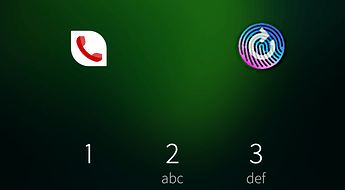

## Fingerprint reader restart in LockScreen

Installing `SailFish Utilities` from the Jolla store we have the chance to restart the fingerprint system when it does not work properly. Some days, it happens often.

I am suggesting adding an icon to restart the fingerprint reader on the lockscreen.

Obviously, fixing the problem is the main way but a quick workaround would mitigate the issue until it wil be investigated and understood.

**A fingerprint sleeping issue?**

Another way to deal with this issue is to start-reset-stop the fingerprint reader only when necessary:

* lockscreen to unlock
* add a new fingerprint

and keep running/ready the rest of the system (software stack) as far as possible.

At the moment, I set the energy saving mode at 100% of battery threshold: always. The fingerprint system fails a lot more times. Possibly, the fingerprint reader will go to sleep when it is not used for a long time and missing to wake it up, brings the system to a failure. Therefore, there is a good chance to solve the problem of switching-on the fingerprint reader when it is going to be used and switching-off it when it is not.
