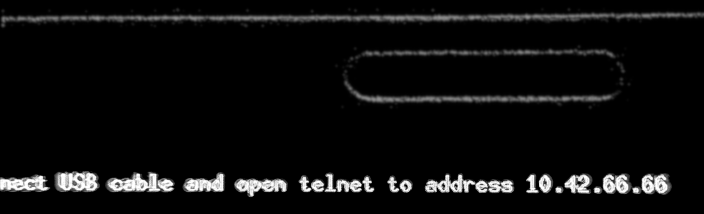

## Recovery image refactoring

The goal is to have a recovery boot mode always available on-demand at users request or automatically when the system is badly bricked:

* when the user leaves the USB cable connected at boot time, there could be a way

* when the UI cannot rise up, a file-flag is set after a watchdog has expired.

Make working the recovery image because it is the starting point for everyone who seriously wants to debug or fix their SFOS and for everyone who wishes to experiment with the system but has a quick recovery option. For this reason, the recovery boot image should be the standard and the only one available to install.

#### BUG REPORT:

```
REPRODUCIBILITY: 100%
OS VERSION: 4.5.0.19
HARDWARE: Xperia 10 II
UI LANGUAGE: English
REGRESSION: no, AFAIK
```

#### DESCRIPTION:


About recovery boot image:

- the `sshd` does not work because the root password is not set as it is supposed to be;
- the factory reset does not work because the scripts are not updated for the Xperia 10 II;
- the `fsck` is based on `busybox` 1.3.4, which requires its extensions but is partially installed because only the `.minix` extension is present, which is useless (cfr. UPDATE #1);
- notice that `telnet 10.42.66.66` is written too small to be read by an average human;
- the recovery image is not supposed to stay in recovery mode forever but to reboot the standard SFOS after a timeout without receiving the first telnet connection;
- even better if the recovery image would NOT boot in recovery mode unless the smartphone is connected by a USB cable during the reboot.

About the last point, connection by USB should be intended so that the data lines are active (and in some advanced battery chargers, this is true) in such a way that a USB network interface can be raised.

#### PRECONDITIONS:

I have flashed into `boot_a` and `boot_b` the `hybris-recovery.img` image.

#### STEPS TO REPRODUCE:

1) satisfy the preconditions above
2) reboot your smartphone
3) enjoy the recovery mode

####  EXPECTED RESULT:

Many but few delivered ;-)

#### ACTUAL RESULT:

That image is available only after flashing the boot partitions with `fastboot` and it is likely to be useless.

#### MODIFICATIONS:

none

#### ADDITIONAL INFORMATION:

I cannot read this:



but using an [ASCII art generator](https://www.ascii-art-generator.org/) service, it would be much easier to read and no particular changes would be required (work smart, not hard).

<sub>

 
```
  #     ###       #        #####       #####   #####       #####   #####  
 ##    #   #      #    #  #     #     #     # #     #     #     # #     #
# #   #     #     #    #        #     #       #           #       #      
  #   #     #     #    #   #####      ######  ######      ######  ######  
  #   #     # ### ####### #       ### #     # #     # ### #     # #     #
  #    #   #  ###      #  #       ### #     # #     # ### #     # #     #
#####   ###   ###      #  ####### ###  #####   #####  ###  #####   #####  
```

</sub>

This is a rendering that is even shrunk down to fit here:


About `root`:`recovery` login on `SSH`, it is enough that a system starting script set the password with the `passwd` command or set the right string into `/etc/shadow` and `/etc/shadow-`, just in case.

<sup>________</sup>

#### UPDATE #1

There is `/bin/e2fsck` and it would be nice that it would linked in `fsck.ext?` as far as possible.

Using `strings` against the ARM64 binary, it reports that `e2fsck` belong to `e2fsprogs` v1.46.5 ([changelog](https://e2fsprogs.sourceforge.net/e2fsprogs-release.html#1.46.5)) and it supports `ext2`, `ext3` and `ext4` filesystems.

Alternatively the `fsck` should be removed or completed with its `fsck.auto` in order to have a coherent user/admin interface: who does not find `fsck`, will search for `e2fsck` or even better `mkfs.auto` and `mkfs.ext?` bring to it.

In the list of supported commands included into `/bin/busybox-static`, the `fsck.auto` is missing in 4.015.9 `rootfs`, `boot` and `recovery` images.

* https://github.com/sailfishos/busybox

Here below the GitHub project with the config for the `SFOS` busybox-static and its `RPM` spec.

<sup>________</sup>

#### UPDATE #2

A enhanced version of `fsck.auto` is here

* https://github.com/robang74/fsck.auto/blob/master/fsck.auto

this script can be completed with these links:

```
cd sbin
ln -sf e2fsck fsck.ext2
ln -sf e2fsck fsck.ext3
ln -sf e2fsck fsck.ext4
```

This configuration has not been tested, yet.

Test can be done also with `telnet 10.42.66.66` then using `passwd` to set the root password to rescue and then use `SSH` to transfer the files.

<sup>________</sup>

#### UPDATE #3

I have extracted both boot images for the `SFOS` v4.5.019 and checked the differences. Then, I started to mod the recovery one. Here below, some hints:

* the text is printed into a single row, therefore the banner approach does not work but an image can be displayed therefore I used my print_banner.sh to create such image

* the `miniUI` on which recovery boot image rely on is on GitHub ([here](https://github.com/sailfishos/yamui)) and as you can see the [only font available](https://github.com/sailfishos/yamui/blob/master/minui/font_10x18.h) is code-cabled with a too tiny dimension `10x18`, the best is to change in something like `25x45` for example.

* after having changed the root password and rebooted again, my `PIN` code was not valid any more. I suppose that the root password in /etc/shadow- is used to encode something related to the `PIN` but correlation is not causation - I have to investigate further. This makes me think that the password for root in `SSH` may be the `PIN` code itself.

* before consuming the 5 tries for the `PIN` code, I have re-flashed the smartphone completely. Just in case, to avoid sending to Jolla for the ultimate recovery procedure. Annoying but I can live with that until I will find out why.

Here a screenshot of the boot:


Clearly, you can see the difference between the "ciao ciao" text in the 10x18 font on the top and the image presentation. Unfortunately, the image will not change in case someone edit the script and change the default `IP` address. In such a case, s/he should recreate the `PNG` image but the banner script allows it in a very quick way.

Finally, the image lacks `strace` and I wish to add to it because it will be very useful in the near future and for debugging purposes especially because the root filesystem (the one on which the `SFOS` usually runs) is available from the recovery boot image.

<sup>________</sup>

#### UPDATE #4

This is image has been created with a 6005 bytes, 121 lines shell not-optimized script.


> ip-10.42.66.66.png: PNG image data, 1120 x 240, 1-bit grayscale, non-interlaced

The script creates the text banner with an arbitrary `IP` address in `PBM` format and then converts it to a 596 bytes `PNG` image suitable to be displayed by `yamui`.

On a running system the script takes 2 seconds to complete but on an after-boot system - equivalent to `sync; echo 3 > /proc/sys/vm/drop_caches` - it takes 5 seconds which is a lot of time¹. However, the image is saved and therefore neither the banner nor the image will be created anymore as long as the `IP` address will not change. For each `IP` address the script will create and store a new image without deleting the others stored and immediately available.

The conversion between `PBM` and `PNG` requires 172Kb of binaries and libraries in addition. The script can be compressed because it is used only once to export functions and therefore can keep 1770 bytes on disk which are 2kb because the smallest storage granularity is 512 bytes block.

Analysing the yamui code, I think that the best is NOT to add the `PBM` format to it even if the `PBM` format is so easy to read that an external library would be excessive but statically linking against that library. Because a `PBM` image has a disk footprint of 538Kb while the `PNG` image 589 bytes (1Kb) unless it would be compressed with `gzip` at 3050 bytes (3kb) which is 3x bigger than `PNG` format but acceptable.

To integrate the `PBMz` compressed format in `yamui`, there are some options:

1. integrate just the `PBM` format² statically linked (few kb) or add the `libnetpbm.so` (150kb) to the system

2. integrate the `zlib` support which the library is on the system and required by `libpng` (216kb) required by `yamui`

3. or create a shell script wrapper that provide decompression in `/tmp` before passing the `PBM` images to `yamui`

4. evaluate to drop the support to `PNG` in favour of `PBMz` images

The #3 makes sense only for a developers version in which `PBM` format is included but not yet the `zlib` one. About #4, why not? The `PNG` format is the standard most used for lossless image compression.

Why add the `PBMz` support? Because the `PBM` images can be easily created by `ASCII` manipulating scripts. Those scripts can use `pnmtopng` (32kb) and `libnetpbm.so` to convert `PBM` in `PNG` but this conversion is not acceptable for *on-the-fly* needs. However, *on-the-fly-needs* can be better satisfied if `yamui` would keep open a file-descriptor in which a new image can be written to update the current which is not the case³, AFAIK.

The, `yamui` project came with some parts and `grep -rn "main("` on its git/source top folder tell us that the parts are three `yaumi`, `yamui-screensaverd` and `yamui-powerkey`. Having three separated binaries is not optimal for embedded systems (*and a smartphone is a class of embedded systems, in particular their rescue/boot images*). The best is the `busybox`/`toybox` approach: one single binary with several links for each function.

<sup>________</sup>

#### Conclusions

The correct approach is to change the `yamui` code in order to let it support multiple-lines text rendering and using a print banner shell script that converts a text into a multi-lines banner which takes tenth of seconds to run.

The best approach is like the one presented above but with a command line option that allows to render the 10x18 (tiny) font multiplicated for a given integer: e.g. 2x (20x36, small), 3x (30x54 regular), 4x (40x72, large), ..., 6x (60x108, huge), etc.

Again³ there is not a specific opened file descriptor to update this text `on-the-fly`, AFAIK.

<sup>________</sup>

#### Notes

¹ instead of 1120x240 pixels image, a 560x120 would have fit the bill as well but 4x less of time to convert it because 4x less of data (estimation, spoiler: *not so straight linear, dear*!).
² the [pdf417decode](https://github.com/robang74/pdf417decode) project on GitHub is a language-C example of such integration.
³  the `d-bus` support can fulfil this shortcoming on a running system but it is not the best approach for a boot/rescue image not as good as <small>`echo goodbye > /run/yamui/update.text`</small>.

---

### About Yamui

These following are some notes took while I was discussing about the recovery boot image in the SFOS community forum.

> @spiiroin wrote:
> 
> Yamui supports externally defined font.

Looking at `res_create_alpha_surface()`, it is not a font but a `PNG` image, and considering what I saw about the `C` definition of the font, it is a table of the `ASCII` printable characters (96 characters) painted in `B/W`. This brings us to appreciate the idea of a script that can generate `B/W` images in `PBM` format, which can be easily converted into `PNG`. Because it can be modified in order to create fonts for `yamui`.

> @nephros wrote:
> 
> One more option could be to have a signal handler for e.g. **USR1** (or even **HUP** ) causing it to reread whatever it was initialized with.

Named pipe, it is an inter-communication process (`IPC`) standard way of going. Socket is specifically tailored for d-bus communication and `kill -HUP` for reloading a daemon configuration. BTW, with `inotify`() there is no need for a signal any more as long as the write and the read are atomic, which is not a granted constraint in the most general case.

These two commits have been developed in 2h 20m. The code is completely untested, and it has never been compiled yet. Therefore, it should be considered a proof-of-concept.

* https://github.com/sailfishos/yamui/compare/master...robang74:yamui:master

> robang74 wrote:
> 
> @piiroin: I have to take care of some stuff about my real-world life. In the meantime, let me know your opinion about this approach or implementation. As soon as this code works as expected, the next step is to integrate the multiple-line text rendering.

I have uploaded to the git repository the script that prints the banner and creates the related PBM and PNG images:

* https://github.com/robang74/yamui/blob/master/banner/print_banner.env

This script has been modified since the last tested version, and it might fail to run properly. It is just a proof-of-concept by now.

The commits I did on my `yamui` fork compile and the results can be downloaded from here:

* [yamui fork](https://github.com/robang74/yamui/)

I have not tested it yet. If you do, you will do it at your own risk.

The recovery image, also in 4.5.0.21, has the following shortcomings.

1. the `/bin/bash` is missing but can be replaced in this way:

> ```
> echo '/sbin/busybox-static ash "$@"' >/bin/bash
> chmod a+x /bin/bash
> ```

2. the `/usr/bin/fsadm` is missing and it is needed by `lvm` resize tools. Moreover, using the one on the `/rootfs` which is a shell script, it fails with `date`

3. the `date` is an applet from busybox-static:

```
sfos # busybox-static  date --help 2>&1 | head -n1
busybox v1.34.1 (2022-09-21 00:00:00 UTC) multi-call binary.
sfos # busybox-static date -u -d"Jan 01 00:00:01 1970" +%s
date: invalid date 'Jan 01 00:00:01 1970'
```

but busybox date can deal with such a format, in fact:

```
pcos # busybox date --help 2>&1 | head -n1
busybox v1.30.1 (Ubuntu 1:1.30.1-7ubuntu3) multi-call binary.
pcos # busybox date -u -d"Jan 01 00:00:01 1970" +%s > 1
```

Therefore, it depends on the options activated in the `busybox` applets config.
