## RedFish OS logo

This folder contains some artwork about the RedFish logo.

```diff

+ RedFish OS, do you feel the power?

```

---

> ### :warning: **ATTENTION**
> 
> These artworks should be considered protected under the copyright and trademark laws, and all rights are reserved. Therefore, the RedFish logo cannot be used unless it has received written permission from the author: check [here](../#license).

The logo and the motto have been proposed to specifically fit the taste and expectations of the [marketing targets](../marketing.md#marketing-targets): Linux embedded engineers in their middle-life age who are looking for an old-good-days simple and powerful tool to cope with mobile devices initially tailored for Android.

---

The two parts of these artworks can be separately used as RedFish OS logo and therefore are protected separately.

<div align="center">

| logo on black background | logo on white backgroud |
| ------------- | ------------- |
| 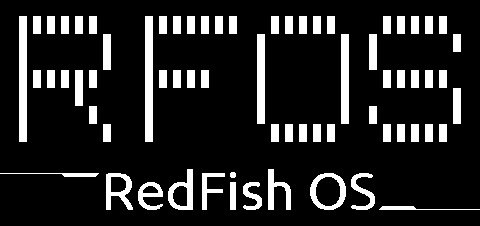 | 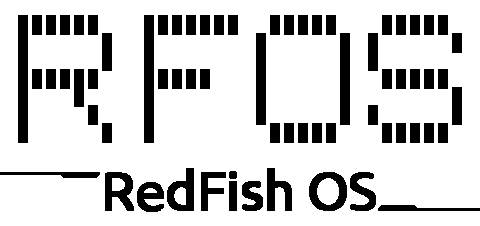 |
| <div align="center">black-white logo</div> | <div align="center">black-white logo</div> |
| 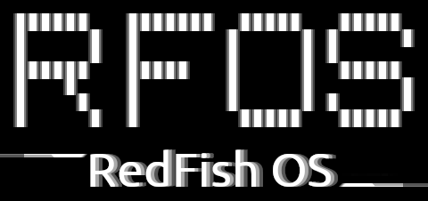 | 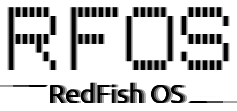 |
| <div align="center">gray-scale logo</div> | <div align="center">gray-scale logo</div> |
| 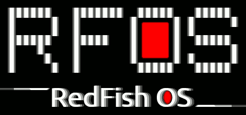 | 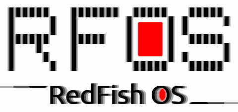 |
| <div align="center">indixed 16 colors logo</div> | <div align="center">indixed 16 colors logo</div> |
| 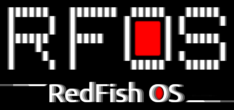 | 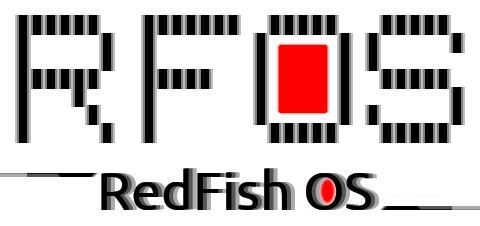 |
| <div align="center">RGB colors logo</div> | <div align="center">RGB colors logo</div> |

</div>

### Pantones

The logo main colors are total black (`#000000`), pure white (`#ffffff`) and full red (`#ff0000`).

---

### Animation

This is the animation which is displayed after the Sony logo until the system is up:

<p><div align="center">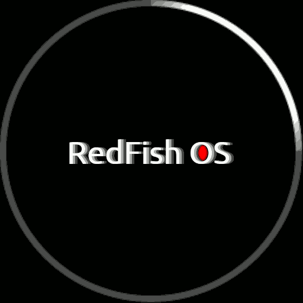</div></p>

This animation seems very similar to the one presented by the SailFish OS but it is not a derived work. In fact, the original animation is based on 8 PNG images in grayscale (256x256 pixels), each of which is about 29 KB (58 blocks). When included in the `cpio.gz` archive, they cannot be compressed anymore, and keep their size. Instead of the RFOS animation, there are 8 PNG images in RGB 512x512 pixels, and in theory, that would have a size of 3 x 2 x 2 = 12 times bigger. Instead, they are about 5.3 KB (11 blocks).

* 58 blocks x 8 images = 464 blocks
* 58 blocks x 3 x 4 x 8 images = 5568 blocks

The ratio between the size expected and the real one is about 2⁶ = 64 which is a **HUGE** gap. Which is the trick? Jolla used a vector template for the animation, like SVG in the original, but trying to bring such a graphic to 16 indexed colours in total creates a lot of artefacts. The artefacts make the animation appear hugly. The solution, is to work pixel by pixel and make the 16 indexed colours look like they were in RGB. Naturally, there is automation to do this work, but the final stage is checking pixel by pixel. This is the main difference between an artwork and an image generated by a vectorial template.

---

### The telnet banner

This is the use of the RFOS logo in combination with the telnet IPv4 informative banner:

<p><div align="center">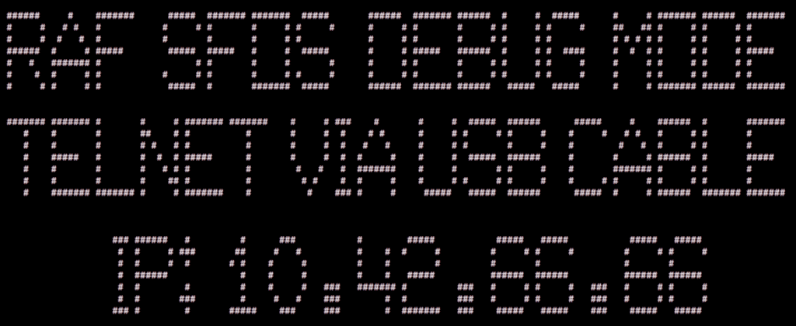</div></p>

Initially to print the banner and creating its related PNG image was a task assigned to a specific [script](r../ecovery/print-banner.sh) due to the limitations of the `yamui` display manager. Now it is rendered in real-time thanks to the effort put into the development of [yamui fork](https://github.com/robang74/yamui) secifically tailored for this project. The `yamui` embedded font is more conventional but the extended functionalities developed can provide a more advanced and flexible display management while the embedded font can replaced by an external font in the future.

---

### Recorded performances

In these two videos the RedFish OS is presented providing two different tasks:

1. a recovery image that can also boot the another operative system based on Linux or Android

    * [video on youtube, 1m17s](https://youtu.be/xT_MR-NgAcU) - RedFish OS recovery image boots a freshly installed SailFish OS.

2. a recovery image that can provide a straightforward interface to flash the entire smartphone

    * [video on youtube, 1m11s](https://youtu.be/EP10Evtl0wo) - RedFish OS recovery image install SailFish OS by the telnet menu.

In the first video, the smartphone boot image is flashed with the RedFish OS image, then it reboots with it in recovery image and then it reboot with the normal operative system, in this case SailFish OS. Notice that all of this takes 1m17s despite the smartphone vendor boot requires 20 seconds at least for each of the two reboots.

In the second video, the smartphone several partitios are re-flashed with SailFish OS official installation images set using the RedFish OS service instead of the `fastboot` mode or for some others operative systems like `/e/OS` the ADB mode. Notice that to complete the whole re-flashing procedure, which writes not less than 1.5GB of data in this case, it takes 70 seconds.

---

### The recovery menu on telnet

The menu available via `telnet` or via `ssh` has different specialised sections:

<p><div align="center">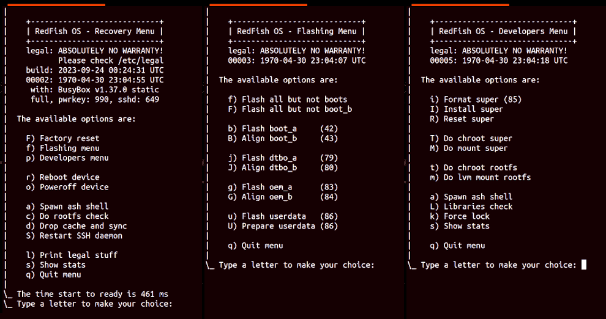</div></p>

Notice that the first rendering of the recovery menu takes 461 ms, and in the past it was about 360 ms. This is because the USB is set to sleep, like many other components. Obviously, the awake process introduced a latency of about 100 ms, but the current consumption dropped to 23 mAh from 46 mAh on average. It has been halved, and the overall advantage is pretty clear.

---

### Native ARM64 build enviroment

The developers menu provides several functionalities to cope with the SailFish OS root filesystem and for preparing the `super` partition, which is 12GB in size on Sony Xperia 10 II, to provide an ARM 64bit native building toolchain based on CentOS 8 Stream for just 642 MB. The `super` partition is dedicated to termporarly store the OTA Android updates but can also permantly or temporarly host a native toolchain system. In fact, installing it requires about 35 seconds.
