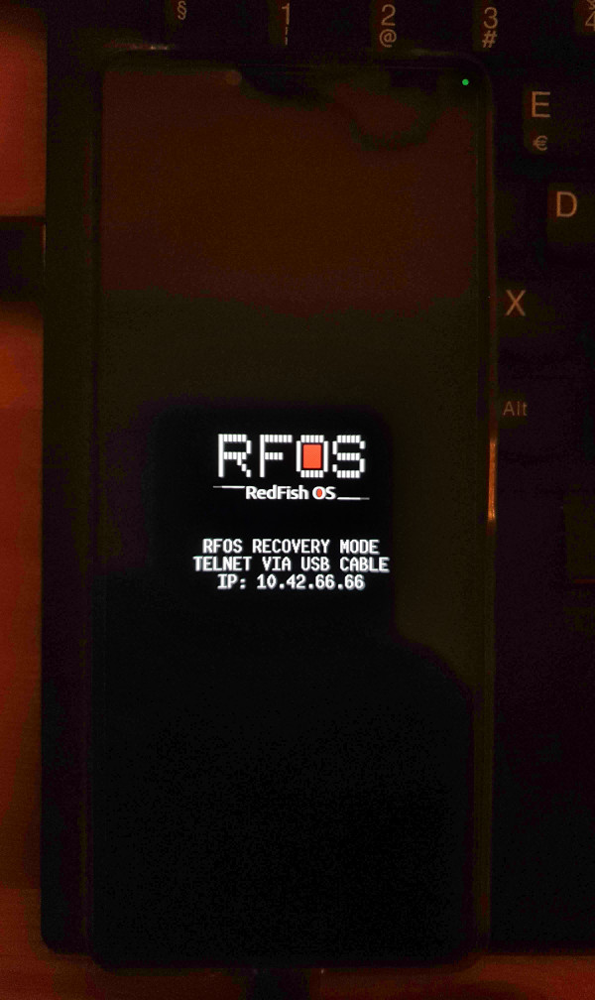
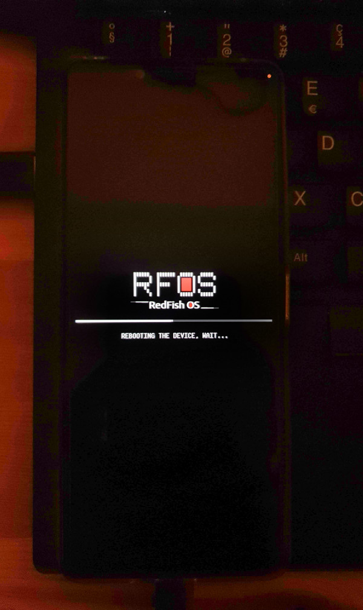
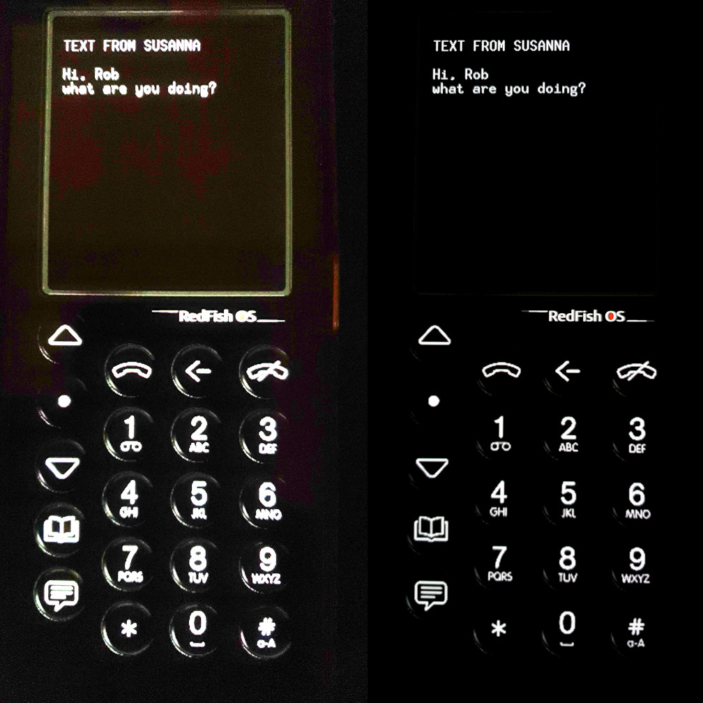
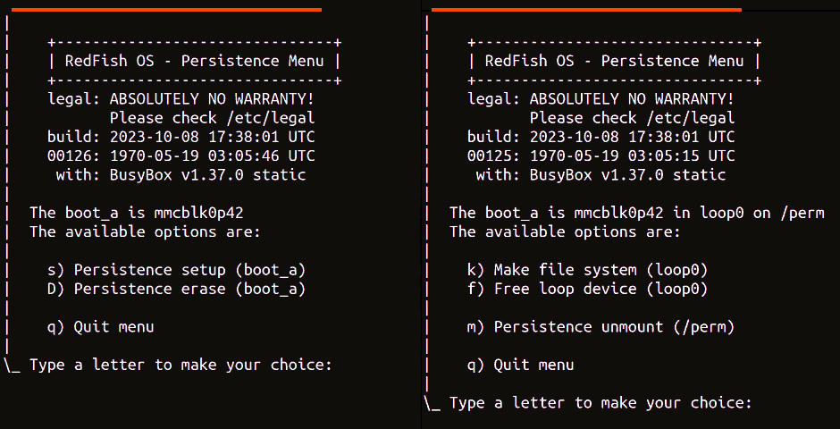

## Marketing

To learn how your business can benefit from the RedFish OS adoption, check this [PDF presentation](RedFishOS-presentation-A4.pdf) introduced by a less than 200 words executive summary.

Just to give you an idea: a Linux-based OS is about 1.5GB, while a modern Android system (10+) is about 2.5GB. The RedFish OS image is less than 30MB and includes the kernel with all the drivers compiled in, the vendor's binary firmwares, the command-line applications, and the networking services. The Sony firmware boot takes 20 seconds, while RedFish OS takes 5 seconds from when the Linux kernel starts to run and when all the services are ready.

---

### Marketing targets

First of all, it is important to notice that this project does not aim to reach the end-user market directly. The RFOS marketing targets are the vendors, the distributors, the engineers, and the modders, including those who are doing such activities as hobbies.

The end-users might have several advantages in having RedFish OS pre-installed as a recovery image or as a supervising system, but they are not the targets of the RFOS marketing because most of the on-the-shelf smartphones do not allow to overwrite the boot or the recovery image, and those that allow it do so not by a bare-simple procedure. Otherwise, end-users would probably brick their smartphones or install a malicious rootkit instead of something really useful. Plus, it would void the vendor's warranty, obviously.

---

### Project presentation

RedFish OS has the primary goal of complementing Android rather than
replacing it. It can serve for various purposes, such as a flashing tool,
firmware supervisor, system configuration manager, IoT fleet manager,
B2C support gateway, benign rootkit for security and privacy, and a
customizable device for penetration testing, which is the reason for
having chosen the name RedFish OS in the first place.

Therefore, RedFish OS is a proof-of-concept demonstrating that Android
hardware support, including a custom kernel and firmware blobs, can be
utilised to run a traditional GNU/Linux system. This opens up a lot of
modding possibilities for every device based on a System-on-Chip (SoC)
with Android support.

Before RedFish OS, companies dealing with embedded systems like
automotive, smart TV, and set-top box manufacturers had to customise
their products for each SoC model and version. They relied on the hope
that hardware producers would provide sufficient support, and they
were involved in technical activities that were costly and challenging.

---

### Logo and brand

Refer to the [logo folder](logo#redfish-os-logo) in order to learn more about it and the product branding. That page contains also some uses cases which might be interesting fo your business.

```diff

+ RedFish OS, do you feel the power?

```

The logo and the motto have been proposed to specifically fit the taste and expectations of the [marketing targets](../marketing.md#marketing-targets): Linux embedded engineers in their middle-life age who are looking for an old-good-days simple and powerful tool to cope with mobile devices initially tailored for Android.

| <sub>loading (led:yellow)</sub> | <sub>working (led:green)</sub> | <sub>reboot (led:red)</sub> |
| ----------------------------------- | -------------------------- | ---------------------------- |
|  |  |  |

These images show the evolution of the graphic presentation. To improve power savings, the screen starts to darken after 15 minutes and can be switched back on by pressing the power button. A frontal green LED kept at low intensity informs the end-user that the smartphone is ON even when the display is completely dark.

---

### Recorded performances

The use of videos is important to tune the expectations: give to the engineers an idea of what has been achieved compared to what can be achieved with their involvement.

In these two videos, the RedFish OS is presented, providing two different tasks:

1. a recovery image that can also boot another operative system based on Linux or Android

   * [video on youtube, 1m17s](https://youtu.be/xT_MR-NgAcU) - RedFish OS recovery image boots a freshly installed SailFish OS.

2. a recovery image that can provide a straightforward interface to flash the entire smartphone

   * [video on youtube, 1m11s](https://youtu.be/EP10Evtl0wo) - RedFish OS recovery image install SailFish OS by the telnet menu.

In the first video, the smartphone boot image is flashed with the RedFish OS image, then it reboots with the recovery image, and after by the user demand it reboots with the normal operative system, in this case SailFish OS. Notice that all of this takes 1m17s despite the fact that the smartphone vendor's firmware boot requires at least 20 seconds for each of the two reboots.

In the second video, the smartphone several partitions are re-flashed with SailFish OS official installation images set using the RedFish OS service instead of the `fastboot` mode or, for some other operative systems like `/e/OS` the ADB mode. Notice that to complete the whole re-flashing procedure, which writes not less than 1.5GB of data in this case, it takes about 70 seconds.

---

### The recovery menu on telnet

Offering a remote root-priviledged shell access is the best way to let engineers know that they can do anything with the system, but offering also a well-designed textual menu is the best way to let them know that RedFish OS is supporting them in being extremely productive, tearing down the operative entry barrier and speeding up the most common operations.

The menu available via `telnet` or via `ssh` has different specialised sections:

<p><div align="center"></div></p>

Notice that the first rendering of the recovery menu takes 461 ms, and in the past it was about 360 ms. This is because the USB is set to sleep, like many other components.

Obviously, the USB awakining introduced a latency of about 100 ms, but the current consumption dropped to 23 mAh from 46 mAh on average. Hence, it has been halved, and the overall advantage is pretty clear.

---

### Native ARM64 build environment

The developers menu provides several functionalities to cope with the SailFish OS root filesystem and for preparing the `super` partition, which is 12GB in size on the Sony Xperia 10 II, to provide an ARM 64-bit native building toolchain based on CentOS 8 Stream for just 642 MB.

The `super` partition is dedicated to temporarily storing the OTA Android updates but can also permanently or temporarily host a native toolchain system. In fact, installing it requires about 35 seconds.

The CentOS 8 Stream has been chosen because for upgrading it to the last version, just a step is required, moving to the CentOS 9 Stream. While Fedora 31 should be updated to Fedora 39.

This means that CentOS offers long-term support for each version, and for this reason, it is much more affine for business adoption. The two distributions have been taken into consideration in the stage2 of the [SFOS refactoring plan](../README.md#about-sfos-refactoring) as a starting point.

---

### Advanced feature for added value

We all know that engineers choose the tools, but it is managers who provide them with the budget. A vendor or distributor, even if they need to provide better support to their customers, tends to be hesitant about investing in a technology that is not directly related to sales and therefore to revenue but just a cost.

In order to address this shortcoming, RedFish OS can provide advanced features that can bring value to end-users. 

A supervising system, a remote fleet management tool, or an advanced recovery image are very valuable services for end-users because these tools help them have as few problems as possible or fix them as fast and easily as possible.

Unfortunately, all of these are valuable assets for vendors, distributors, and professional modders, but their customers, especially end-users, rarely perceive the effort and value in caring about them.

Instead, some advanced features like the Punkt MP01 virtual clone (or a Nokia 3310 virtual clone, depending on the skin) can be perceived as an effective added value.

The [Punkt MP01](https://www.punkt.ch/en/products/mp01-mobile-phone/#buy) is sold at the sale price of $169 with 2G support only, while the [Punkt MP02](https://www.punkt.ch/en/products/mp02-4g-mobile-phone/#buy) is sold for $379 with 2G, 3G, and 4G support.

The added value of having such a virtual clone is pretty clear to end-users. In fact, they can leave the office for a holiday, disconnect themselves to enjoy their free time, and still be reachable by texts and phone calls from a selected number of people.

The phonebook, call history and text messages can be manage by a user-friendly web interface available only via USB cable to grant the privacy and securita. Moreover, in this mode, the smartphone can endure between 3 and 6 days in standby, depending on the signal coverage, with a full charge of the battery.

---

### Welcome back Nokia 3310

Inspired by Punkt. MP01, I have decided to adapt their design to RedFish OS for delivering an added-value advance feature. The photo below shows just a presentation, not even a working proof-of-concept. After all, the software adaptation to create it required just a working-day dedicated effort, and it would be insane to expect a full phone to work in such a small amount of time.

<div align="center">



<sub>*On the right a high-exposure photo and on the right the same that shows the layer.*</sub>

</div>

What took more effort was the power-saving. The smartphone consumes a maximum of 81 mAh with the display on and in interactive mode, while it consumes 23 mAh on average when it is in standby waiting for an event. This means that with a 3600 mAh battery, it stands by for 156 hours. with little improvement towards 21.4 mAh on average, it will be a whole week.

---

### Persistent data and menu

First of all, it is important to clarify that a recovery image for its nature SHOULD NOT rely on any kind of persistent data otherwise its mission to be ALWAYS available and ALWAYS identical in its features among services different boots would be gone and moreover a persistent data can break it.

However, because the RedFish OS can be also used for assisting developers, modders and debuggers. It make sense that they can save some persistent data somewhere which is strictly associated with the bootable recovery image like the WLAN name and password, for example.

This can be acceptable as far as and as long as that data can be used just after the boot and by a manual procedure like a specific menu. The persistence menu is a contextual one and depending the state of the persistence, it shows some options rather than others.

<div align="center"></div>

The persistent data is written into a loop device which refers to the last 4MB of the boot partition. The persistence is granted by the script that generates the RedFish OS recovery image which limits its size in order that `fastboot` will never overwrite the last portion of the boot partition.
