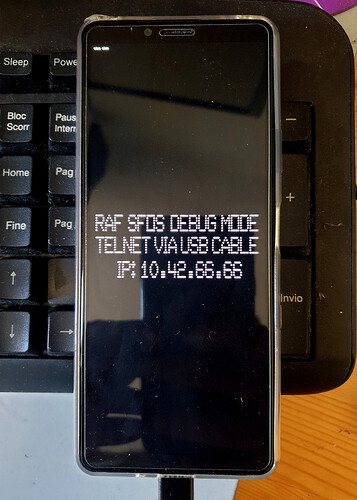
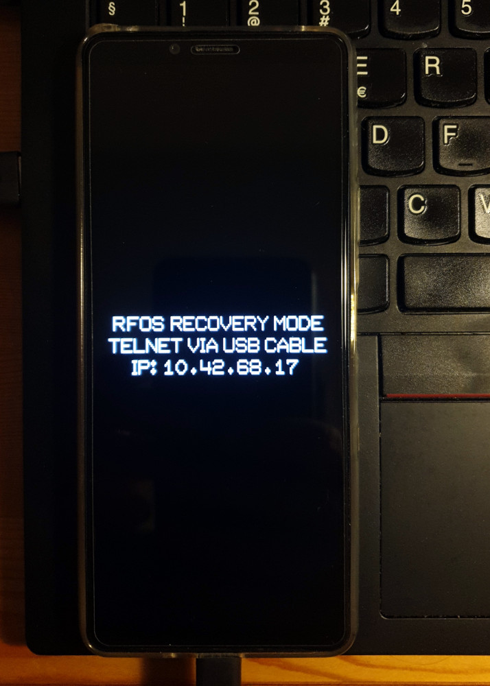
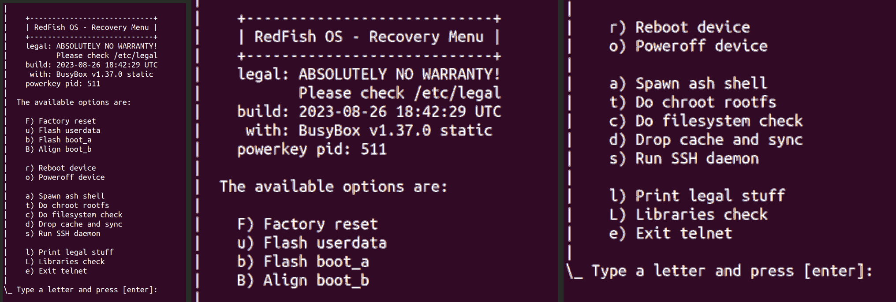

## The recovery ramdisk

This folder contains - by now - just a few scripts about the early `init` process that are part of a broader recovery image rework.

- [init](init) - this is the first script that runs after the kernel.
    - [init.usb](init.usb) - this is the script that configures the USB gadget.
    - [init.hr](init.hr) - this is the script for the recovery mode if a USB connection is found.
    - [init.hb](init.hb) - this is the script for the normal boot mode otherwise.

The recovery multi-mode boot image is less than 8Mb bigger than the original:

* `hybris-recovery.img` - 20.6 MB, original from SailFish OS
* `rfos-boot-image.img` - 28.2 MB, refactored multi-mode boot image
    * with [busybox 1.36.1](https://github.com/robang74/sailfish-os-busybox), [yamu 1.2.1](https://github.com/robang74/yamui), [hw-ramdisk 1.1.2](https://github.com/robang74/hw-ramdisk) and [json-c 0.15](https://github.com/robang74/json-c) compiled from sources
    * with new binaries: `dd_rescue`, `parted`, `pigz`, `stdbuf`, `dd`, `cgdisk`, `gdisk`, `sgdisk` and `fixparts`
    * with the related dependencies and libraries from CentOS

Two are the reasons for the bigger size: new binaries added and having replace every binary and library in the original image with the counterpart from `CentOS 8 Stream` apart for four specific packages that instead have been recompiled from a forked version of the sources.

#### Quality and Scalability

This brings in the great advantage that the new recovery is:

1. as default as possible because as many parts as possible came from CentOS 8 Stream repositories.
2. completely reproducible due to GitHub versioning and GitHub Action, also for those few packages out of CentOS.
3. easy to upgrade from CentOS 8 to 9: busybox is static, json-c.so.5 is included in 9, others 2 are straighforward.
4. easy to expand because everything available for CentOS 8 Stream can be added with a minimum effort.

In short, **quality** about the product and **scalability** about the process. 

---

### A lot of fined-tuned details

This recovery image is plenty of fine-tuned¹ details, and includes an [image to display](../../forum/todo/recovery-telnet-phonescreen.jpeg) properly the IP address telnet message. Plus, it automatically goes into recovery mode when the smartphone is connected to a laptop/PC USB, but not if it is connected to a power source. Otherwise, it boots normally. Therefore, it can be the default and the only boot image.

The most interesting feature is that the image can be repackaged and flashed on both `boot_a`, `boot_b` in just two seconds. The trick? The use of the SSH to flash the partitions: the recovery image can update itself.

Obviously, it can also deliver a restore of a previous backup for any partition, and it can also flash every partition, even if the image is `spare` one. A task that usually requires `fastboot` on the Laptop/PC installed and the smartphone in its special mode. Because the boot partitions can be updated with the `ADB` protocol - which seems much more reliable with USB v3.x-only hardware than `fastboot` - the full installation procedure can also be done via this recovery image. Potentially, the up/downgrade or a restore of the Android system can also be done in this way.

Hence, there are tools out there that have a good chance to collect dust in the future, like fastboot, Sony Emma, XperiFirm, etc.

The day the recovery image will be able to establish a LTE or a WLAN connection², it can potentially do the entire SFOS {installation, recovery, restore, maintenance, debugging, etc.} by remote and in live with someone else from remote, properly authorised by an one-single-time-use RSA key. 

The final outcome is that we will connect our smartphone to our laptop/PC and ask for a reboot. Soon after, the smartphone will enter recovery mode, and potentially, with our browser, we can manage the entire system, including flashing partitions.

---

### A supervising firmware

In the [recovery image refactoring](../../forum/todo/recovery-image-refactoring.md) page, it was highlighted some shortcomings about the SailFish OS recovery image that was properly reworked. Instead, it rappresents a great opportunity to do much more stuff than a rare-events fallback minimal system but an ordinary tool for system mainteinance.

Obviously, having a full suite of scripts that can run on `busybox ash` with no adaptation or a little adaptation makes this image even more intriguing. In the long term, we can see it as a supervising firmware composed of three main components: a monolithic Linux kernel dedicated to a specific device, a full-features statically linked busybox and a minimal graphical interface like [yamui](https://github.com/robang74/yamui).

---

### A system configurations manager

About the first stage of the SailFish OS [refactoring](../../#about-sfos-refactoring) described in three points, the 1.2 is the combination of the 1.1 and 1.3 because when we have a recovery image always available that can run in RAM and manage filesystems and partitions, backups, and restores, applying a system patch is just a matter of keeping a local database of them and their backup. It is just a matter of perspective: 

- patch manager runs on SFOS and applies volatile patches on SFOS mainly for UI or system services like SSH which do not specifically require a reboot, or connman (in particular about firewalling rules), which require a SFOS utilities restart.

- system patch manager can run on the recovery image and therefore can safely handle any system patch before the SFOS boot or after its end of work.

You can object that a system patch manager, which is a set of shell scripts, forces the end-users to cope with a console, SSH, telnet, etc. but I never wrote that. I wrote that being able to operate with a bare minimum running system like shell scripts is a **must** for a system patch manager³. I never wrote that end-users should cope with a console but suggested that they use their laptop/PC browser, which is not something immediate to develop but feasible with a reasonable effort.

Before being a tool available for end-user, it can be a fundamental tool for an embedded system architect that wishes to evolve the SailFish OS helped by an assisting tool that can provide backup and retore within a minute.

*After all, Rome has not been built during a night, but block by block with a plan in mind.*

---

### The binary compatibility

> #### :information_source: **Note**
> 
> The recovery image adopted the `CentOS 8 stream` binary line, included the `glibc` while some applictions are still compiled for SailFish OS which employs a different `glibc` toolchain. The two are almost compatible but they differ enough to let some app crashes. For example `busybox` `telnetd` which is statically linked but compiled in a SFOS SDK container when is going to load at run time functions form CentOS glibc NSS library (even if it is configured to do not so, in theory) crashes. On the other side, the CentOS `sshd` presents a various kind of failures.

Despite the differences between CentOS and SailFish OS glibc, a wrapper framework of 76 KB has been developed in order to let both running safe on the same recovery image. The layer size and complexity could potentially grown when the number of application will increase.

However, on the long term it is reasonable that SailFish OS apps will be recompiled in a similar SDK but based on CentOS while some specific components in the recovery image like `busybox` and `dropbear` will be compiled statically linked against `musl` instead of `glibc`. Therefore, the binary libraries compatibility will be an issue that will affect a marginal number of applications.

#### Why CentOS

I made my selection among those distributions using the RPM format, like SailFish OS. Fedora and CentOS are the two most well-known candidates. In particular, Fedora 31 and CentOS 8 shown a kind of binary compatibility at the glibc library level. To upgrade the SFOS to an up-to-day distribution, it is required to step from Fedora 31 to 38 or from CentOS 8 to 9. This means that CentOS has a life spawn much longer, and therefore it is more suitable for a long-term business.

---

### Managing the display in recovery mode

This is the message displayed to invite the user to connect via `telnet` to the recovery menu:

| image generated with gimp on the pc | image generated on-the-fly |
| ----------------------------------- | -------------------------- |
|  |  |

Until the IPv4 address `10.42.66.66` for telnet changes, the banner image should not be created, but it is included in the recovery image. However, the banner script will continue to be useful when `yamui` will be able to support the font-size multiplicator and multi-line text displaying. In the meantime, the banner script can generate a new image in 1.5 seconds, while the USB data link detection requires about 2 seconds. Therefore, even in the worst case, it does not add any extra delay.

---

### The recovery menu on telnet

The recovery menu screenshot image is shown at its 50% size:



Right click and open in a tab, to enlarge.

---

### Some facts and stats

A few facts and stats about the RFOS recovery image:

- boot time since the kernel starts until the init script takes over: 3.12 seconds
- init time in recovery mode 2.5s included 2s for waiting the USB network raises up
- power consumption of 101 mAh while untouched with logo and IPv4 telnet banner at half of brightness
- power consumption drops to 86 mAh when the screen brightness is dimmed to the minimum.

Before the power-saving optimisation was started, the power consumption was always 136 mAh. Moreover, it does:

- sfter 15 minutes, the display brightness is set to minimum, but the powerkey can raise it to maximum;
- then, within 60 seconds, the display brightness will be capped to half of the maximum again.

The powerkey-handler.sh is immortal, and start/stop simply enable/disable its action. Ignoring the powerkey event is shown with a text printed in the console and dimming the display brightness to 100% from 10% and back to 50% within about 2 seconds. If the powerkey event is not ignored and happens while the lock is taken, then the RFOS animation starts, and when the lock is released, the shutdown will be executed. The shutdown is presented with a 4 seconds long bar that it is filling, and usually at its half or 2/3 the system is shutdown.

Forcing the device to reboot is always possible by pressing powerkey + volume up + down for a few seconds.

At the beginning of the `init` script:

- the CPUs governor is set to `conservative`;
- the internal flash disk caching is disabled; 
- the power control of the internal flash disk is set to `on`.

Moreover, when the recovery init procedure is completed:

- the display brightness is set to half of the maximum;
- the firmware kernel load is disabled: it stops trying to load the missing firmware.

The telnet service is raised as soon as possible, as well as the sshd. The telnet service offers the menu, while the sshd offers an interactive login shell based on `busybox ash` in which the recovery functions are pre-loaded into its environments. Mounting and umounting the root filesystem by `lvm` can be performed on the user's demand by the telnet recovery menu or by a ssh section using the proper functions `lvm_mount` and `lvm_umount`.

In `/tmp/bms_current_avg.log` is stored the 10s average current absorbtion taken every second, and the `showbmscur` shows the statistics about it:

```
=> Current 10s average absorbtion:
  \_ sleep drift: 4121 ppm 865.577 %
  \_ load avg: 2.02 2.03 1.75 1/356 5935
  \_ samples: 1670
  \_ min: 86 mAh
  \_ max: 101 mAh
```

As you can see `sleep 1` can last up to near 9 seconds. Possibly it happens when the CPU working frequency drops and the jiffies rate changes. While `sleep 60` is correct with a precision higher that 1:1000.

---

### Private git repo log

This reported here below, is the private git repository log on branch `devel4`. The tags indicate the size of the recovery boot image expressed in kilobytes.

<sub>
    
```gitlog
* 10f0c47 - ramdisk: new busybox-static binary v1.36.1+git2-raf4 for SFOS  (tag: 28.152)
* e31dba0 - powerkey-handler.sh: bug fix init /dev/tty inibition + better in menu 
* 12b4846 - ramdisk: wraps openssh binaries to exclusively use libnss_files.so.2 
* 56f50d8 - .apps: dd_rescue, dd_rhelp and dd as binary added as extra opt. comp. 
* cd6be77 - .apps: dbclient added among the extra optional components 
* 4432981 - .apps: ramdisk-functions.env appends 64 zero blocks to the image 
* 31cd5d2 - .apps: created .stab as link to .apps/spacetabs.sh because gitshell 
* de22b52 - .apps: this folder contains scripts and extra optional contentents 
* 2480707 - ramdisk: dropbear static added in prepartion to replace sshd 
* cab6c38 - ramdisk: /bin/nologin created as link to /bin/false 
* d640064 - init: permissions and password management 
* 511cad9 - init: grants ownership and rwx-settings to special files in .rwx 
* b24cb03 - recovery-menu.sh: set HOME for 'root' as stated in /etc/passwd 
* 0493cfd - recovery-menu.sh: interactive ash exit !0 trap in lock bug fix 
* 522fcc7 - recovery-menu.sh: busybox version added on the menu header 
* 1358a48 - recovery-menu.sh: fsck support added in lvm_mount() and reboot_device() 
* deb95ea - recovery-menu.sh: fs_recovery() evolved for the new lvm2 + lock bug fix 
* 15ff373 - recovery-menu.sh: filesystem check perform lvm mount 
* aff4278 - recovery-functions.env: when sshd fails to start, show an error 
* 7e98811 - recovery-functions.env: sshd starts without option -q 
* 824f505 - init: sshd_execution() moved in functions and called after telnetd 
* 9fee5f1 - recovery-functions.env: drop cache sets 'write trough' policy 
* 5231538 - powerkey-handler.sh: present the shutdown by yamui (to improve) 
* a17f8ed - ramdisk: dd_rescue, dd_rhelp and dd removed  (tag: 27.768)
* 7ca5de1 - ramdisk: yamui et al, upgraded compiled from sources 
* 5879f27 - ramdisk: json-c library updated compiled from sources 
* 8fab501 - ramdisk: replacing all the SFOS binaries with CentOS 8 
* d14b713 - ramdisk: replacing all the SFOS libraries with CentOS 8 
* e057aac - recovery-menu.sh: new way of displaying ldd output 
* 380944b - ramdisk-functions.env: renamed and updated 
* 47d79e8 - ramdisk: cgdisk, gdisk, sgdisk and fixparts added new + dependencies  (tag: 26.940)
* 7d2967a - ramdisk: tools stdbuf, parted and dd_rescue added to the image 
* 3dd21ba - ramdisk.function: skip ramdisk.function and skip new additions 
* 20e6f11 - recovery-menu.sh: libraries check added into the recovery menu 
* 6e23da3 - ramdisk: removed lib64/libnss_*.so.2 not needed anymore  (tag: 25.600)
* 5517755 - ramdisk: folders /lib64 and /usr/lib64 merged togheter 
* ad37860 - ramdisk: folders /lib and /lib64 merged togheter 
* 2721ba2 - ramdisk: folders /*/*bin merged togheter 
* 37f2180 - ramdisk: folders /sbin and /bin merged togheter 
* 5819f17 - ramdisk: folders /usr/sbin and /usr/bin merged togheter 
* d3fadb8 - scripts: minor changes, mainly aesthetic 
* 64137de - ramdisk: complete set of libraries, added those missing 
* 654bb22 - ramdisk: sshd and scp upgrade from CentOS 8 repository 
* 87925c3 - ramdisk: /usr/bin/bin removed, unpigz->pigz plus other minor changes 
* eaf9c22 - ramdisk: evkey, reboot2 and rtc-clear updated compiled from sources 
* eafc2b6 - ramdisk: lvm upgrade from CentOS 8 repository with its dependencies 
* 11cb9bd - ramdisk: updated to busybox 1.36.1 with xz support in static 
* da754e2 - powerkey-handler.sh bugfixing, p.3 
* e403125 - recovery-menu.sh: reorganisation and nicer printouts, p.3 
* 6dc44ec - powerkey-handler.sh bugfixing, p.2 
* 0d6f493 - recovery-menu.sh: reorganisation and nicer printouts, p.1 
* 755db3d - recovery-functions.env, bugfixing 
* b71fc01 - powerkey-handler.sh bugfixing 
* d90b8b7 - ramdisk.function: returns correctly the error code 
* c80dd6b - recovery-menu.sh: reorganisation and nicer printouts 
* 16e81d4 - .gitignore ignores etc/build becuse changes at every repackage 
* 8e9c58c - ramdisk: shell scripts and flash_userdata_partition() cleaning 
* 221d262 - ramdisk: working on flash_userdata_partition() 
* 05e0e65 - ramdisk.function and spacetabs.sh added new 
* 0143123 - recovery-menu.sh: recovery menu option b) added for boot_a flashing 
* e1fc04d - ramdisk: sftp to flash the boot_a, untested and moving to netcat 
* e3955be - ramdisk: commit the current state of the ramdisk folder  (tag: 22.312)
```

</sub>

The first commit is authored on `Sun Aug 20 07:58:33 2023 +0200` and does not contain the starting point but a developed version good enough to be the starting point for the transition towards a CentOS 8 stream. The [logo folder](../../logo) in this repository is authored on `Sat Aug 19 22:48:48 2023 +0200` and the temporal correlation has a cause-effect relationship: as soon as I realised that I would be able to deliver in `stage1` a kind of product, I branded it.

---

**Notes**

1. Among those details, there is also the `telnet` menu item `4) Perform file system check` that is doing its duty properly now.

2. Rather than establishing an autonomous connection to the internet, much more practical and easier is leveraging the GNU/Linux laptop/PC as a proxy in such a way that the recovery image can have an Internet connection using the one available on the workstation, which seems more appropriate after all.

3. or a system configuration manager that can develop (or integrate) a IoT fleet manager as soon as the recovery image is able to access an Internet connection independently, which can be a technical challenge for a software/service company but not for vendors like Sony or Qualcomm. Again, it is just a matter of perspective.
