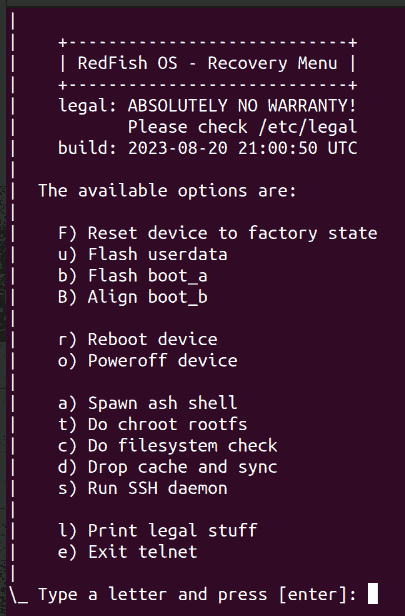

## The recovery ramdisk

This folder contains - by now - just a few scripts about the early `init` process that are part of a broader recovery image rework.

- [init](init) - this is the first script that runs after the kernel.
- [init.usb](init.usb) - this is the script that configures the USB gadget.
- [init.hr](init.hr) - this is the script for the recovery mode if a USB connection is found.
- [init.hb](init.hb) - this is the script for the normal boot mode otherwise.

The new recovery image is less than 2Mb bigger than the original, including the [recovery utils package](../#about-recovery-package) command line tools and its extra dependencies, while the boot partition is 64 MB. Hence, there is a lot of space that is still available for future expansions, and the [system debug package](../#about-sysdebug-package) is about 14 MB (compressed size because also the boot image is compressed in the same way) with its extra library for the recovery image. The following sizes are shown in KB instead:

```
20616 hybris-recovery.img
22436 rfos-boot-image.img
23516 rfos-boot-image.img with dd_rescue, parted and their dependencies
```

This recovery image is plenty of fine-tuned¹ details, and includes an [image to display](../../forum/todo/recovery-telnet-phonescreen.jpeg) properly the IP address telnet message. Plus, it automatically goes into recovery mode when the smartphone is connected to a laptop/PC USB, but not if it is connected to a power source. Otherwise, it boots normally. Therefore, it can be the default and the only boot image.

The most interesting feature is that the image can be repackaged and flashed on both `boot_a`, `boot_b` in just two seconds. The trick? The use of the SSH to flash the partitions: the recovery image can update itself.

Obviously, it can also deliver a restore of a previous backup for any partition, and it can also flash every partition, even if the image is `spare` one. A task that usually requires `fastboot` on the Laptop/PC installed and the smartphone in its special mode. Because the boot partitions can be updated with the `ADB` protocol - which seems much more reliable with USB v3.x-only hardware than `fastboot` - the full installation procedure can also be done via this recovery image. Potentially, the up/downgrade or a restore of the Android system can also be done in this way.

Hence, there are tools out there that have a good chance to collect dust in the future, like fastboot, Sony Emma, XperiFirm, etc.

The day the recovery image will be able to establish a LTE or a WLAN connection², it can potentially do the entire SFOS {installation, recovery, restore, maintenance, debugging, etc.} by remote and in live with someone else from remote, properly authorised by an one-single-time-use RSA key. 

The final outcome is that we will connect our smartphone to our laptop/PC and ask for a reboot. Soon after, the smartphone will enter recovery mode, and potentially, with our browser, we can manage the entire system, including flashing partitions.

---

### A supervising firmware

In the [recovery image refactoring](../../forum/todo/recovery-image-refactoring.md) page, it was highlighted some shortcomings about the SailFish OS recovery image that was properly reworked. Instead, it rappresents a great opportunity to do much more stuff than a rare-events fallback minimal system but an ordinary tool for system mainteinance.

Obviously, having a full suite of scripts that can run on `busybox ash` with no adaptation or a little adaptation makes this image even more intriguing. In the long term, we can see it as a supervising firmware composed of three main components: a monolithic Linux kernel dedicated to a specific device, a full-features statically linked busybox and a minimal graphical interface like [yamui](https://github.com/robang74/yamui).

---

### A system configurations manager

About the first stage of the SailFish OS [refactoring](../../#about-sfos-refactoring) described in three points, the 1.2 is the combination of the 1.1 and 1.3 because when we have a recovery image always available that can run in RAM and manage filesystems and partitions, backups, and restores, applying a system patch is just a matter of keeping a local database of them and their backup. It is just a matter of perspective: 

- patch manager runs on SFOS and applies volatile patches on SFOS mainly for UI or system services like SSH which do not specifically require a reboot, or connman (in particular about firewalling rules), which require a SFOS utilities restart.

- system patch manager can run on the recovery image and therefore can safely handle any system patch before the SFOS boot or after its end of work.

You can object that a system patch manager, which is a set of shell scripts, forces the end-users to cope with a console, SSH, telnet, etc. but I never wrote that. I wrote that being able to operate with a bare minimum running system like shell scripts is a **must** for a system patch manager³. I never wrote that end-users should cope with a console but suggested that they use their laptop/PC browser, which is not something immediate to develop but feasible with a reasonable effort.

Before being a tool available for end-user, it can be a fundamental tool for an embedded system architect that wishes to evolve the SailFish OS helped by an assisting tool that can provide backup and retore within a minute.

*After all, Rome has not been built during a night, but block by block with a plan in mind.*

---

### Managing the display in recovery mode

This is the message displayed to invite the user to connect via `telnet` to the recovery menu:

| image generated with gimp on the pc | image generated on-the-fly |
| ----------------------------------- | -------------------------- |
|  |  |

Until the IPv4 address `10.42.66.66` for telnet changes, the banner image should not be created, but it is included in the recovery image. However, the banner script will continue to be useful when `yamui` will be able to support the font-size multiplicator and multi-line text displaying. In the meantime, the banner script can generate a new image in 1.5 seconds, while the USB data link detection requires about 2 seconds. Therefore, even in the worst case, it does not add any extra delay.

---

### The recovery menu on telnet



---

**Notes**

1. Among those details, there is also the `telnet` menu item `4) Perform file system check` that is doing its duty properly now.

2. Rather than establishing an autonomous connection to the internet, much more practical and easier is leveraging the GNU/Linux laptop/PC as a proxy in such a way that the recovery image can have an Internet connection using the one available on the workstation, which seems more appropriate after all.

3. or a system configuration manager that can develop (or integrate) a IoT fleet manager as soon as the recovery image is able to access an Internet connection independently, which can be a technical challenge for a software/service company but not for vendors like Sony or Qualcomm. Again, it is just a matter of perspective.
